# 🤖 FAAST Integration Plan for AutoSecForge

**Full Agentic Application Security Testing (FAAST)** integration to enhance AutoSecForge with AI-driven vulnerability detection and exploitation verification.

---

## 📋 Overview

This document outlines the integration of FAAST capabilities into AutoSecForge to provide:

1. **LLM-Powered SAST** – AI-driven static code analysis
2. **Intelligent DAST** – AI-guided dynamic exploitation verification
3. **Unified Vulnerability Pipeline** – From detection to exploitation proof

**FAAST Repository**: https://github.com/yacwagh/FAAST

---

## 🎯 Key Features to Integrate

### 1. **AI-Driven SAST Scanner**
- **Component**: `agent_tools/sast/sast_tool.py`
- **Features**:
  - Code chunking for large files (80-line segments)
  - LLM-based vulnerability detection
  - Support for SQL Injection & Command Injection
  - Vulnerability severity classification
  
**Integration Point**: `src/SastAnalyzer.php` (new)

```bash
# Python backend for SAST
tools/faast-sast/
├── sast_analyzer.py       # Main SAST scanner
├── chunk_processor.py      # Code chunking logic
├── vulnerability_mapper.py # Vuln type classification
└── prompts.py             # LLM system prompts
```

---

### 2. **LLM Exploitation Strategy Generator**
- **Component**: `llm/prompts/prompts_dast.py`
- **Features**:
  - Automatically generates exploit strategies
  - Creates precise payloads for each vulnerability type
  - Identifies vulnerable endpoints and parameters
  
**Integration Point**: New MCP connector: `mcp-faast-exploiter`

```json
{
  "vulnerability_type": "SQL Injection",
  "description": "Unsanitized user input in WHERE clause",
  "endpoint": "/employees/search",
  "method": "GET",
  "params": {
    "id": {
      "type": "query",
      "value": "'1' OR '1'='1"
    }
  }
}
```

---

### 3. **Intelligent Browser Automation (DAST)**
- **Component**: `agent_tools/dast/dast_act.py`
- **Features**:
  - Selenium-based dynamic testing
  - LLM-powered vulnerability verification
  - Response analysis for exploitation success

**Integration Point**: `tools/faast-dast-orchestrator/`

---

### 4. **Unified SecurityAgent Orchestrator**
- **Component**: `agent/agent.py`
- **Features**:
  - Coordinates SAST → DAST → Verification pipeline
  - Combines findings into unified report
  
**Integration Point**: New dashboard API endpoint: `/api/faast/scan`

---

## 🏗️ Architecture Integration

```mermaid
flowchart TB
    Dashboard["AutoSecForge Dashboard<br/>(PHP 8.3)"]
    
    subgraph FAAST["FAAST LLM Pipeline"]
        LLM["OpenRouter LLM<br/>(GPT-4.1 Nano)"]
        SAST["AI SAST Scanner<br/>(Code Analysis)"]
        Strategy["Strategy Generator<br/>(Exploit Planning)"]
        DAST["Browser Automation<br/>(Exploitation)"]
        Verify["LLM Verifier<br/>(Success Analysis)"]
    end
    
    subgraph MCP["MCP HackStrike"]
        FaastConn["faast_mcp<br/>(JSON-RPC Connector)"]
    end
    
    Dashboard -->|/api/faast/scan| FaastConn
    FaastConn --> SAST
    SAST --> LLM
    LLM --> Strategy
    Strategy --> DAST
    DAST --> Verify
    Verify --> LLM
    Verify -->|Results| Dashboard
    
    style FAAST fill:#533483,stroke:#00A67E,stroke-width:2px
    style Dashboard fill:#1a1a2e,stroke:#00A86B,stroke-width:2px
    style MCP fill:#0f3460,stroke:#FF4500,stroke-width:2px
```



---

## 📦 Implementation Roadmap

### **Phase 1: LLM SAST Integration** (Week 1)
- [ ] Create `src/SastAnalyzer.php` – PHP wrapper for FAAST SAST
- [ ] Create `tools/faast-sast/` Python package
- [ ] Integrate with MCP HackStrike: `faast_sast_mcp` connector
- [ ] Store SAST findings in `findings` table with source: `faast_sast`
- [ ] Dashboard UI: Display SAST findings with AI confidence scores

**New Database Field**:
```sql
ALTER TABLE findings ADD COLUMN ai_confidence DECIMAL(3,2);
ALTER TABLE findings ADD COLUMN analysis_source ENUM('sonarqube','faast_sast','zap','manual');
```

---

### **Phase 2: LLM Exploitation Strategy** (Week 2)
- [ ] Create `tools/faast-dast-orchestrator/` Python service
- [ ] Implement `ExploitationStrategyEngine` class
- [ ] MCP Connector: `faast_strategy_mcp`
- [ ] Generate payloads for: SQL Injection, Command Injection, XSS, SSRF
- [ ] API Endpoint: `POST /api/faast/generate-strategy`

**New API Endpoint**:
```php
POST /api/faast/generate-strategy
{
  "finding_id": 123,
  "vulnerability_type": "SQL Injection",
  "endpoint": "/employees/search",
  "parameters": ["id"]
}

Response:
{
  "strategy_id": "strat_abc123",
  "endpoint": "/employees/search",
  "method": "GET",
  "payloads": [
    {
      "param": "id",
      "value": "'1' OR '1'='1",
      "type": "query"
    }
  ],
  "expected_indicators": ["Database error", "Unexpected results"]
}
```

---

### **Phase 3: Browser Automation DAST** (Week 3)
- [ ] Create `tools/faast-dast-executor/` (Python with Selenium)
- [ ] Implement automated exploitation playbook
- [ ] MCP Connector: `faast_dast_executor_mcp`
- [ ] Response capture and analysis
- [ ] Dashboard: Real-time exploitation results with video/screenshots

**New Dashboard Feature**:
- "DAST Exploit" button on each finding
- Real-time browser automation log
- Screenshot/video evidence of exploitation

---

### **Phase 4: Vulnerability Verification** (Week 4)
- [ ] LLM-based response analysis
- [ ] Vulnerability confirmation scoring (0-100)
- [ ] False positive filtering
- [ ] Auto-update finding status: `unverified` → `verified_exploitable`
- [ ] Batch verification for all SAST findings

**New Finding Status**:
```sql
ALTER TABLE findings ADD COLUMN verification_status 
  ENUM('unverified','verification_pending','verified_exploitable','verified_non_exploitable','false_positive');
```

---

## 🔌 MCP Connector Specification

### **Connector: `faast_orchestrator_mcp`**

**Endpoints**:
- `POST /rpc` – Main JSON-RPC endpoint

**RPC Methods**:

#### 1. **`faast_run_full_pipeline`**
```json
{
  "jsonrpc": "2.0",
  "id": 1,
  "method": "faast_run_full_pipeline",
  "params": {
    "target_path": "/var/www/app",
    "base_url": "http://localhost:8080",
    "vulnerability_types": ["SQL Injection", "Command Injection"],
    "headless": true
  }
}
```

**Response**:
```json
{
  "jsonrpc": "2.0",
  "id": 1,
  "result": {
    "sast_findings": 5,
    "dast_verified": 3,
    "false_positives": 2,
    "findings": [
      {
        "id": "faast_001",
        "type": "SQL Injection",
        "severity": "critical",
        "file": "routes/employees.js",
        "endpoint": "/employees/search",
        "exploitable": true,
        "evidence": "Response contained DB error"
      }
    ]
  }
}
```

#### 2. **`faast_run_sast_only`**
```json
{
  "method": "faast_run_sast_only",
  "params": {
    "target_path": "/var/www/app",
    "file_pattern": "*.js"
  }
}
```

#### 3. **`faast_generate_exploit_strategy`**
```json
{
  "method": "faast_generate_exploit_strategy",
  "params": {
    "vulnerability_type": "SQL Injection",
    "code_snippet": "SELECT * FROM users WHERE id = " + req.query.id,
    "endpoint": "/api/users",
    "base_url": "http://localhost:8080"
  }
}
```

#### 4. **`faast_execute_dast`**
```json
{
  "method": "faast_execute_dast",
  "params": {
    "strategy": { /* strategy object */ },
    "base_url": "http://localhost:8080",
    "headless": true
  }
}
```

---

## 📊 Database Schema Updates

### **New Tables**

#### `faast_scans`
```sql
CREATE TABLE faast_scans (
    id INT UNSIGNED PRIMARY KEY AUTO_INCREMENT,
    project_id INT UNSIGNED NOT NULL,
    scan_type ENUM('sast_only','full_pipeline','dast_only') NOT NULL,
    status ENUM('pending','running','completed','failed') NOT NULL,
    sast_findings INT DEFAULT 0,
    dast_verified INT DEFAULT 0,
    false_positives INT DEFAULT 0,
    start_time DATETIME,
    end_time DATETIME,
    created_by INT UNSIGNED NOT NULL,
    created_at TIMESTAMP DEFAULT CURRENT_TIMESTAMP,
    FOREIGN KEY (project_id) REFERENCES projects(id) ON DELETE CASCADE,
    FOREIGN KEY (created_by) REFERENCES users(id) ON DELETE RESTRICT
);
```

#### `exploitation_strategies`
```sql
CREATE TABLE exploitation_strategies (
    id INT UNSIGNED PRIMARY KEY AUTO_INCREMENT,
    finding_id INT UNSIGNED NOT NULL,
    strategy_json JSON NOT NULL,
    endpoint VARCHAR(512),
    method ENUM('GET','POST','PUT','DELETE'),
    payloads JSON,
    generated_at TIMESTAMP DEFAULT CURRENT_TIMESTAMP,
    FOREIGN KEY (finding_id) REFERENCES findings(id) ON DELETE CASCADE
);
```

#### `dast_execution_logs`
```sql
CREATE TABLE dast_execution_logs (
    id INT UNSIGNED PRIMARY KEY AUTO_INCREMENT,
    strategy_id INT UNSIGNED NOT NULL,
    execution_status ENUM('success','failed','timeout') NOT NULL,
    response_status INT,
    response_body LONGTEXT,
    response_headers JSON,
    evidence_screenshot LONGBLOB,
    verification_result JSON,
    execution_time DATETIME,
    FOREIGN KEY (strategy_id) REFERENCES exploitation_strategies(id) ON DELETE CASCADE
);
```

### **Existing Table Updates**

```sql
ALTER TABLE findings ADD COLUMN (
    ai_confidence DECIMAL(3,2),
    analysis_source ENUM('sonarqube','faast_sast','zap','manual'),
    verification_status ENUM('unverified','verification_pending','verified_exploitable','verified_non_exploitable','false_positive'),
    faast_scan_id INT UNSIGNED,
    FOREIGN KEY (faast_scan_id) REFERENCES faast_scans(id) ON DELETE SET NULL
);
```

---

## 🚀 Docker Compose Services

### **New Services to Add**

```yaml
# tools/faast-sast/Dockerfile
faast-sast:
  build:
    context: ./tools/faast-sast
  image: autosecforge/faast-sast:latest
  environment:
    OPENROUTER_API_KEY: ${OPENROUTER_API_KEY}
  networks:
    - asf_internal
  restart: unless-stopped

# tools/faast-dast-executor/Dockerfile
faast-dast:
  build:
    context: ./tools/faast-dast-executor
  image: autosecforge/faast-dast:latest
  environment:
    OPENROUTER_API_KEY: ${OPENROUTER_API_KEY}
  networks:
    - asf_app
  volumes:
    - faast_evidence:/app/evidence
  restart: unless-stopped

# Updated MCP HackStrike
mcp-hackstrike:
  # ... existing config ...
  environment:
    # Add FAAST connectors
    ENABLED_CONNECTORS: "sonarqube_mcp,faast_sast_mcp,faast_strategy_mcp,faast_dast_mcp,zap_mcp"
```

---

## 🔐 Environment Variables (Update `.env`)

```bash
# FAAST Configuration
OPENROUTER_API_KEY=sk-or-v1-xxxxx          # OpenRouter API key
FAAST_ENABLED=true
FAAST_MODEL=openai/gpt-4.1-nano            # LLM model
FAAST_HEADLESS=true                        # Headless browser mode
FAAST_MAX_PAYLOAD_ATTEMPTS=5               # Max exploitation attempts per vuln
FAAST_VERIFY_WITH_LLM=true                 # Use LLM for verification
```

---

## 🎨 Dashboard UI Components

### **New Pages/Sections**

1. **FAAST Scanner Page** (`public/faast-scanner.php`)
   - Input: Project path, target URL
   - Start full FAAST pipeline
   - Real-time progress indicator
   - Live browser stream (optional)

2. **Exploitation Strategy Dashboard** (`public/faast-strategies.php`)
   - List all generated strategies
   - Visual payload editor
   - Manual exploitation override
   - Export strategy as JSON

3. **DAST Execution Results** (`public/faast-dast-results.php`)
   - Timeline of exploitation steps
   - Screenshots/video evidence
   - Response analysis
   - Verification status

---

## 📝 API Endpoints (New)

```
POST   /api/faast/scan                    Start full FAAST pipeline
GET    /api/faast/scan/{scan_id}          Get scan status & results
POST   /api/faast/generate-strategy       Generate exploit strategy
POST   /api/faast/execute-dast            Execute DAST against strategy
POST   /api/faast/verify-finding          Verify finding exploitability
GET    /api/faast/strategies              List all strategies
DELETE /api/faast/strategy/{strategy_id}  Delete strategy
```

---

## 🛠️ Implementation Code Examples

### **Example 1: PHP SAST Wrapper**

```php
// src/SastAnalyzer.php
class SastAnalyzer
{
    private $mcp;
    
    public function __construct(MCPClient $mcp)
    {
        $this->mcp = $mcp;
    }
    
    public function analyzePath(string $targetPath): array
    {
        $result = $this->mcp->call('faast_run_sast_only', [
            'target_path' => $targetPath,
            'file_pattern' => '*.js'
        ]);
        
        return $this->mapFindingsToDatabase($result);
    }
    
    private function mapFindingsToDatabase(array $result): array
    {
        $db = Database::getInstance();
        $findings = [];
        
        foreach ($result['findings'] as $finding) {
            $stmt = $db->prepare(
                'INSERT INTO findings 
                 (scan_run_id, title, severity, description, 
                  analysis_source, ai_confidence, verification_status)
                 VALUES (?, ?, ?, ?, ?, ?, ?)'
            );
            
            $stmt->execute([
                $_POST['scan_run_id'],
                $finding['vulnerability_type'],
                strtolower($finding['severity']),
                $finding['description'],
                'faast_sast',
                $finding['confidence'] ?? 0.75,
                'unverified'
            ]);
            
            $findings[] = ['id' => $db->lastInsertId()];
        }
        
        return $findings;
    }
}
```

### **Example 2: Exploitation Strategy UI Component**

```php
// public/faast-strategies.php
<?php
require_once __DIR__ . '/../src/helpers.php';
require_once __DIR__ . '/../src/Database.php';

requireLogin();

if ($_SERVER['REQUEST_METHOD'] === 'POST' && $_POST['action'] === 'generate_strategy') {
    $finding_id = filter_input(INPUT_POST, 'finding_id', FILTER_VALIDATE_INT);
    
    $db = Database::getInstance();
    $stmt = $db->prepare('SELECT * FROM findings WHERE id = ?');
    $stmt->execute([$finding_id]);
    $finding = $stmt->fetch();
    
    // Call MCP to generate strategy
    $strategy = $mcp->call('faast_generate_exploit_strategy', [
        'vulnerability_type' => $finding['title'],
        'endpoint' => $finding['endpoint'] ?? '/api/endpoint',
        'base_url' => $_POST['base_url']
    ]);
    
    // Save strategy to database
    $stmt = $db->prepare(
        'INSERT INTO exploitation_strategies 
         (finding_id, strategy_json, endpoint, method)
         VALUES (?, ?, ?, ?)'
    );
    $stmt->execute([
        $finding_id,
        json_encode($strategy),
        $strategy['endpoint'],
        $strategy['method']
    ]);
}
?>
```

---

## ✅ Testing Checklist

- [ ] SAST scanner identifies SQL Injection in code
- [ ] SAST scanner identifies Command Injection in code
- [ ] Strategy generator creates valid payloads
- [ ] DAST executor runs exploitation without errors
- [ ] LLM verification confirms/denies exploitation success
- [ ] Findings marked as verified/false_positive
- [ ] Dashboard displays FAAST results alongside other tools
- [ ] All results exported to PDF/Excel reports
- [ ] API endpoints return valid JSON responses
- [ ] Database schema migrations run successfully

---

## 📚 References

- FAAST Repository: https://github.com/yacwagh/FAAST
- FAAST Documentation: Full Agentic Application Security Testing
- OpenRouter API: https://openrouter.ai/docs
- Selenium Documentation: https://www.selenium.dev/

---

## 🎯 Success Criteria

✅ **Phase 1 Complete**: SAST findings appear in AutoSecForge dashboard  
✅ **Phase 2 Complete**: Exploitation strategies generated and viewable  
✅ **Phase 3 Complete**: DAST automation runs and captures evidence  
✅ **Phase 4 Complete**: Vulnerabilities verified with high confidence scores  
✅ **Integration Complete**: Full FAAST pipeline operational end-to-end  

---

**Author**: AutoSecForge Integration Team  
**Last Updated**: 2024  
**Status**: Ready for Implementation
