# 🛡️ Advanced Integration Plan: FAAST + DevSecOps-MCP for AutoSecForge

**Complete AI-Powered DevSecOps Security Automation** combining:
- **FAAST** (Full Agentic Application Security Testing) - LLM-driven SAST/DAST
- **DevSecOps-MCP** (Model Context Protocol Server) - Unified security tool orchestration

---

## 📊 Integration Architecture

```mermaid
graph TB
    subgraph UI["AutoSecForge Dashboard"]
        Dashboard["Web UI<br/>(PHP 8.3)"]
        Reports["Advanced Reports<br/>(PDF/HTML/SARIF)"]
    end

    subgraph MCP_Hub["MCP HackStrike Hub"]
        Router["JSON-RPC Router"]
        Orchestrator["DevSecOps Orchestrator"]
    end

    subgraph FAAST_Pipeline["FAAST AI Pipeline"]
        LLM["OpenRouter LLM<br/>(GPT-4.1 Nano)"]
        SAST["AI SAST Scanner"]
        Strategy["Exploit Strategy Gen"]
        DAST["Browser Automation"]
        Verify["LLM Verifier"]
    end

    subgraph Security_Tools["Security Tool Integrations"]
        SonarQube["SonarQube<br/>(SAST)"]
        ZAP["OWASP ZAP<br/>(DAST)"]
        Semgrep["Semgrep<br/>(SAST)"]
        Bandit["Bandit<br/>(Python SAST)"]
        OsvScan["OSV Scanner<br/>(SCA)"]
        Trivy["Trivy<br/>(Container/Repo)"]
        NpmAudit["npm audit<br/>(SCA)"]
    end

    Dashboard -->|API| Router
    Router -->|Orchestrate| Orchestrator
    
    Orchestrator -->|SAST/DAST/SCA/IAST| FAAST_Pipeline
    Orchestrator -->|Legacy Tools| Security_Tools
    
    FAAST_Pipeline --> LLM
    FAAST_Pipeline --> SAST
    FAAST_Pipeline --> DAST
    FAAST_Pipeline --> Verify
    
    SAST -->|Results| Dashboard
    DAST -->|Results| Dashboard
    Verify -->|Reports| Dashboard
    
    Dashboard -->|Generate| Reports

    style UI fill:#1a1a2e,stroke:#00A86B,stroke-width:2px
    style MCP_Hub fill:#0f3460,stroke:#FF4500,stroke-width:2px
    style FAAST_Pipeline fill:#533483,stroke:#00A67E,stroke-width:2px
    style Security_Tools fill:#16213e,stroke:#e94560,stroke-width:2px
```



---

## 🎯 Key Features Integration

### **From FAAST**
✅ LLM-powered vulnerability detection  
✅ Intelligent exploitation strategy generation  
✅ Real-time browser automation for DAST  
✅ Automated vulnerability verification  
✅ AI-driven false positive filtering  

### **From DevSecOps-MCP**
✅ Unified MCP server architecture  
✅ Multi-tool orchestration (SAST, DAST, SCA, IAST)  
✅ Policy enforcement & quality gates  
✅ Comprehensive reporting (JSON, HTML, PDF, SARIF)  
✅ Claude AI integration ready  
✅ Pre-commit hook integration  
✅ CI/CD pipeline integration  

---

## 🏗️ Four-Phase Implementation

### **Phase 1: MCP Foundation & Tool Integration** (Week 1)
**Goal**: Establish unified MCP server with all security tools

#### Deliverables
- [ ] Enhanced MCP HackStrike with DevSecOps connectors
- [ ] SAST connector: Semgrep + Bandit integration
- [ ] DAST connector: ZAP advanced features
- [ ] SCA connector: OSV Scanner + Trivy + npm audit
- [ ] Database schema updates

#### New Files
```
tools/mcp-security-hub/
├── server.ts                    # Enhanced MCP server
├── tools/
│   ├── sast-unified.ts         # Semgrep + Bandit + SonarQube
│   ├── dast-advanced.ts        # ZAP with policies & auth
│   ├── sca-combined.ts         # OSV + Trivy + npm audit
│   └── policy-engine.ts        # Quality gates & enforcement
├── connectors/
│   ├── semgrep.ts
│   ├── bandit.ts
│   ├── zap-advanced.ts
│   ├── osv-scanner.ts
│   ├── trivy.ts
│   └── npm-audit.ts
└── config/
    ├── security-rules.yml      # Policy definitions
    └── tool-configs.json       # Tool-specific settings
```

#### API Endpoints (Phase 1)
```
POST   /mcp/rpc                   Main MCP JSON-RPC endpoint
POST   /api/security/sast         Run SAST scan (unified)
POST   /api/security/dast         Run DAST scan (with policies)
POST   /api/security/sca          Run SCA scan (multi-tool)
GET    /api/security/policy       Get active security policy
```

---

### **Phase 2: FAAST Integration** (Week 2)
**Goal**: Integrate AI-powered SAST/DAST pipeline

#### Deliverables
- [ ] FAAST Python backend containerization
- [ ] LLM exploitation strategy generator
- [ ] Browser automation orchestrator
- [ ] Vulnerability verification engine
- [ ] Dashboard UI for FAAST controls

#### New Files
```
tools/faast-engine/
├── Dockerfile
├── requirements.txt
├── src/
│   ├── agent/
│   │   ├── orchestrator.py      # Main FAAST coordinator
│   │   └── context_builder.py   # Finding context processor
│   ├── sast/
│   │   ├── ai_analyzer.py       # LLM-based code analysis
│   │   ├── chunker.py           # Code chunking for large files
│   │   └── vulnerability_mapper.py
│   ├── dast/
│   │   ├── strategy_engine.py   # Exploitation strategy gen
│   │   ├── browser_agent.py     # Selenium automation
│   │   └── response_analyzer.py
│   └── llm/
│       ├── service.py           # OpenRouter client
│       ├── prompts.py           # System prompts
│       └── verification.py      # Result verification
└── api/
    ├── flask_app.py            # REST API
    └── mcp_integration.py       # MCP connector
```

#### Key MCP Methods
```json
{
  "method": "faast_run_full_pipeline",
  "params": {
    "target_path": "/app",
    "base_url": "http://localhost:8080",
    "vulnerability_types": ["SQL Injection", "Command Injection"],
    "headless": true,
    "ai_verification": true
  }
}

{
  "method": "faast_generate_strategies",
  "params": {
    "finding_ids": [1, 2, 3],
    "batch_mode": true
  }
}

{
  "method": "faast_execute_dast",
  "params": {
    "strategy_id": "strat_abc123",
    "timeout": 300
  }
}
```

#### Dashboard Components
- FAAST Scanner Control Panel
- Real-time Exploitation Pipeline
- Strategy Visualization
- Evidence Gallery (screenshots/videos)

---

### **Phase 3: Policy Engine & Quality Gates** (Week 3)
**Goal**: Implement security policy enforcement

#### Deliverables
- [ ] Configurable security policies
- [ ] Quality gates (zero-trust model)
- [ ] Automatic remediation workflows
- [ ] Compliance reporting (OWASP, CWE, CVSS)
- [ ] Pre-commit hook integration

#### Security Policy Format
```yaml
# security-policy.yml
version: "1.0"
policies:
  zero_trust:
    critical: 0
    high: 0
    medium: 5
    low: unlimited
  
  quality_gates:
    sast:
      required_tools: [semgrep, sonarqube]
      min_coverage: 80
    dast:
      scan_types: [baseline, full]
      exclude_patterns: [/health, /metrics]
    sca:
      allow_low_licenses: false
      max_vulnerable_deps: 0
  
  remediation:
    auto_fix: true
    patch_deadline: 7 days
    escalation: slack://security-channel
```

#### Pre-commit Hook
```bash
#!/bin/bash
# .git/hooks/pre-commit
set -e

# Run security checks
curl -X POST http://localhost:6300/rpc \
  -d '{
    "jsonrpc": "2.0",
    "method": "validate_security_policy",
    "params": {
      "staged_files": true,
      "policy_file": ".security-policy.yml"
    }
  }'
```

#### CI/CD Integration
```yaml
# .github/workflows/security-gates.yml
name: Security Quality Gates
on: [pull_request, push]
jobs:
  security-scan:
    runs-on: ubuntu-latest
    steps:
      - uses: actions/checkout@v3
      - name: Run Security Gates
        run: |
          curl -X POST $MCP_SERVER_URL/mcp \
            -d '{
              "method": "validate_security_policy",
              "params": {"policy_file": ".security-policy.yml"}
            }'
```

---

### **Phase 4: Advanced Reporting & Analytics** (Week 4)
**Goal**: Comprehensive vulnerability tracking and reporting

#### Deliverables
- [ ] Multi-format reporting (JSON, HTML, PDF, SARIF, CycloneDX)
- [ ] Vulnerability correlation across tools
- [ ] Trend analysis & metrics dashboard
- [ ] Custom report generation
- [ ] Evidence archival system

#### Report Formats
```
# SARIF (for GitHub Security tab)
├── runs[0].tool.driver.name
├── runs[0].results[].ruleId
├── runs[0].results[].level
└── runs[0].results[].locations[].physicalLocation

# CycloneDX (for SCA)
├── bom.components[].vulnerabilities
├── bom.components[].licenses
└── bom.version

# Custom HTML Report
├── Executive Summary
├── Finding Details
├── Evidence Gallery
├── Remediation Roadmap
└── Compliance Checklist
```

#### Analytics Dashboard
- Vulnerability trends (30/60/90 day)
- Tool accuracy comparison
- False positive rate analysis
- MTTR (Mean Time To Remediate)
- Compliance status

---

## 📦 Database Schema Enhancements

### New Tables

#### `security_policies`
```sql
CREATE TABLE security_policies (
    id INT UNSIGNED PRIMARY KEY AUTO_INCREMENT,
    name VARCHAR(255) UNIQUE NOT NULL,
    policy_yaml LONGTEXT NOT NULL,
    version VARCHAR(50),
    active BOOLEAN DEFAULT 0,
    created_by INT UNSIGNED NOT NULL,
    created_at TIMESTAMP DEFAULT CURRENT_TIMESTAMP,
    FOREIGN KEY (created_by) REFERENCES users(id) ON DELETE RESTRICT
);
```

#### `mcp_tool_results`
```sql
CREATE TABLE mcp_tool_results (
    id INT UNSIGNED PRIMARY KEY AUTO_INCREMENT,
    scan_id INT UNSIGNED NOT NULL,
    tool_name ENUM('semgrep','bandit','sonarqube','zap','osv','trivy','npm_audit') NOT NULL,
    tool_version VARCHAR(50),
    result_json LONGTEXT,
    execution_time INT, -- milliseconds
    status ENUM('success','failed','timeout') NOT NULL,
    executed_at TIMESTAMP DEFAULT CURRENT_TIMESTAMP,
    FOREIGN KEY (scan_id) REFERENCES faast_scans(id) ON DELETE CASCADE
);
```

#### `exploitation_evidence`
```sql
CREATE TABLE exploitation_evidence (
    id INT UNSIGNED PRIMARY KEY AUTO_INCREMENT,
    dast_log_id INT UNSIGNED NOT NULL,
    evidence_type ENUM('screenshot','video','log','http_request','http_response') NOT NULL,
    content LONGBLOB,
    mime_type VARCHAR(100),
    created_at TIMESTAMP DEFAULT CURRENT_TIMESTAMP,
    FOREIGN KEY (dast_log_id) REFERENCES dast_execution_logs(id) ON DELETE CASCADE
);
```

#### `vulnerability_correlations`
```sql
CREATE TABLE vulnerability_correlations (
    id INT UNSIGNED PRIMARY KEY AUTO_INCREMENT,
    primary_finding_id INT UNSIGNED NOT NULL,
    correlated_finding_id INT UNSIGNED NOT NULL,
    correlation_confidence DECIMAL(3,2),
    correlation_type ENUM('duplicate','related','dependent'),
    created_at TIMESTAMP DEFAULT CURRENT_TIMESTAMP,
    FOREIGN KEY (primary_finding_id) REFERENCES findings(id) ON DELETE CASCADE,
    FOREIGN KEY (correlated_finding_id) REFERENCES findings(id) ON DELETE CASCADE
);
```

### Table Alterations

```sql
-- Add to findings table
ALTER TABLE findings ADD COLUMN (
    tool_source VARCHAR(50),                          -- semgrep, zap, trivy, etc
    tool_confidence DECIMAL(3,2),                     -- Tool confidence score
    ai_verification_score DECIMAL(3,2),               -- FAAST verification
    correlated_findings JSON,                         -- Related findings
    remediation_steps TEXT,                           -- Auto-generated fixes
    estimated_effort VARCHAR(20),                     -- Fix effort estimate
    affected_components JSON                          -- Impacted code/infra
);

-- Add to scan_runs table
ALTER TABLE scan_runs ADD COLUMN (
    policy_id INT UNSIGNED,
    policy_enforced BOOLEAN DEFAULT 0,
    compliance_status ENUM('pass','fail','warning'),
    mcp_execution_id VARCHAR(255),
    FOREIGN KEY (policy_id) REFERENCES security_policies(id)
);
```

---

## 🔌 MCP Connectors Architecture

### **Connector: `mcp-security-orchestrator`**

**RPC Methods (Unified Interface)**:

```json
// 1. Run unified SAST (all tools)
{
  "method": "run_sast_scan",
  "params": {
    "target": "/path/to/code",
    "tools": ["semgrep", "bandit", "sonarqube"],
    "rules": "owasp-top-10",
    "output_format": "sarif"
  }
}

// 2. Run intelligent DAST
{
  "method": "run_dast_scan",
  "params": {
    "target_url": "http://localhost:8080",
    "scan_type": "full",
    "policy": "zero-trust",
    "headless": true,
    "evidence_capture": true
  }
}

// 3. Run multi-tool SCA
{
  "method": "run_sca_scan",
  "params": {
    "project_path": "/path/to/project",
    "tools": ["npm-audit", "osv-scanner", "trivy"],
    "fix_vulnerabilities": true,
    "license_check": true
  }
}

// 4. Execute FAAST pipeline
{
  "method": "faast_run_full",
  "params": {
    "target_path": "/app",
    "base_url": "http://localhost:8080",
    "ai_enhanced": true,
    "verify_exploitability": true
  }
}

// 5. Validate against policy
{
  "method": "validate_security_policy",
  "params": {
    "policy_id": 1,
    "scan_results": ["scan_123", "scan_456"],
    "fail_on_policy_breach": true
  }
}

// 6. Generate multi-format report
{
  "method": "generate_security_report",
  "params": {
    "scan_ids": ["scan_123"],
    "formats": ["html", "pdf", "sarif", "json"],
    "include_remediation": true,
    "include_evidence": true
  }
}
```

---

## 🐳 Docker Compose Services

```yaml
# Enhanced services to add

# FAAST Engine
faast-engine:
  build:
    context: ./tools/faast-engine
    dockerfile: Dockerfile
  image: autosecforge/faast-engine:latest
  environment:
    OPENROUTER_API_KEY: ${OPENROUTER_API_KEY}
    FAAST_MODE: production
    LOG_LEVEL: info
  networks:
    - asf_internal
    - asf_app
  depends_on:
    - mcp-hackstrike
  restart: unless-stopped
  volumes:
    - faast_cache:/tmp/faast-cache

# Enhanced MCP Security Hub
mcp-security-hub:
  build:
    context: ./tools/mcp-security-hub
    dockerfile: Dockerfile
  image: autosecforge/mcp-security-hub:latest
  environment:
    MCP_PORT: 6300
    SECURITY_STRICT_MODE: "true"
    ENABLED_CONNECTORS: "semgrep,bandit,zap-advanced,osv,trivy,npm-audit,faast"
    POLICY_ENGINE_ENABLED: "true"
  ports:
    - "6300:6300"
  networks:
    - asf_internal
    - asf_app
  depends_on:
    - db
  restart: unless-stopped
  volumes:
    - ./src/config/security-rules.yml:/app/config/security-rules.yml:ro
    - ./src/config/tool-configs.json:/app/config/tool-configs.json:ro

# Browser automation service (for DAST)
browser-automation:
  image: selenium/standalone-chrome:latest
  environment:
    SE_NODE_SESSION_TIMEOUT: 300
    SE_NODE_MAX_SESSIONS: 1
  networks:
    - asf_app
  restart: unless-stopped
  volumes:
    - browser_cache:/tmp/browser-cache

volumes:
  faast_cache:
  browser_cache:
```

---

## 🔐 Environment Variables (Updated `.env`)

```bash
# ===== FAAST Configuration =====
OPENROUTER_API_KEY=sk-or-v1-xxxxx
FAAST_ENABLED=true
FAAST_MODEL=openai/gpt-4.1-nano
FAAST_HEADLESS=true
FAAST_MAX_PAYLOAD_ATTEMPTS=5
FAAST_VERIFY_WITH_LLM=true

# ===== DevSecOps-MCP Configuration =====
MCP_PORT=6300
SECURITY_STRICT_MODE=true
POLICY_ENGINE_ENABLED=true
REPORT_FORMATS=json,html,pdf,sarif,cyclonedx

# ===== SAST Tools =====
SEMGREP_ENABLED=true
BANDIT_ENABLED=true
SONARQUBE_URL=http://sonarqube:9000
SONARQUBE_TOKEN=${SONARQUBE_TOKEN}

# ===== DAST Tools =====
ZAP_URL=http://zap:8090
ZAP_API_KEY=${ZAP_API_KEY}
ZAP_HEADLESS=true

# ===== SCA Tools =====
OSV_SCANNER_PATH=/usr/local/bin/osv-scanner
TRIVY_PATH=/usr/local/bin/trivy
TRIVY_CACHE_DIR=/tmp/trivy-cache
NPM_AUDIT_ENABLED=true

# ===== Policy & Compliance =====
SECURITY_POLICY_FILE=.security-policy.yml
ZERO_TRUST_MODE=true
MAX_CRITICAL_VULNS=0
MAX_HIGH_VULNS=0
COMPLIANCE_FRAMEWORKS=owasp,cwe,cvss

# ===== Reporting =====
REPORT_OUTPUT_DIR=/var/www/reports
EVIDENCE_RETENTION_DAYS=90
AUTO_REMEDIATION_ENABLED=true
```

---

## 📝 Implementation Code Examples

### **Example 1: Enhanced PHP Dashboard Integration**

```php
// public/security-orchestration.php
<?php
require_once __DIR__ . '/../src/helpers.php';
require_once __DIR__ . '/../src/Database.php';

requireLogin();

class SecurityOrchestrator {
    private $mcp;
    private $db;
    
    public function __construct() {
        $this->mcp = new MCPClient('http://localhost:6300');
        $this->db = Database::getInstance();
    }
    
    public function runFullSecurityPipeline(string $projectPath, string $baseUrl): array {
        $results = [
            'sast' => $this->runSAST($projectPath),
            'dast' => $this->runDASTWithPolicy($baseUrl),
            'sca' => $this->runSCA($projectPath),
            'faast' => $this->runFAAST($projectPath, $baseUrl),
        ];
        
        // Validate against policy
        $policyValidation = $this->validatePolicy($results);
        $results['policy_status'] = $policyValidation;
        
        // Generate comprehensive report
        $results['report'] = $this->generateMultiFormatReport($results);
        
        return $results;
    }
    
    private function runSAST(string $projectPath): array {
        $response = $this->mcp->call('run_sast_scan', [
            'target' => $projectPath,
            'tools' => ['semgrep', 'bandit', 'sonarqube'],
            'output_format' => 'sarif'
        ]);
        
        // Store results
        $this->storeToolResults('sast', $response);
        return $response;
    }
    
    private function runDASTWithPolicy(string $baseUrl): array {
        $policy = $this->loadActivePolicy();
        
        $response = $this->mcp->call('run_dast_scan', [
            'target_url' => $baseUrl,
            'scan_type' => 'full',
            'policy' => $policy['name'],
            'evidence_capture' => true
        ]);
        
        $this->storeToolResults('dast', $response);
        return $response;
    }
    
    private function validatePolicy(array $results): array {
        $policy = $this->loadActivePolicy();
        
        return $this->mcp->call('validate_security_policy', [
            'policy_id' => $policy['id'],
            'scan_results' => $this->extractScanIds($results)
        ]);
    }
    
    private function generateMultiFormatReport(array $results): array {
        return $this->mcp->call('generate_security_report', [
            'scan_ids' => $this->extractScanIds($results),
            'formats' => ['html', 'pdf', 'sarif', 'json'],
            'include_remediation' => true,
            'include_evidence' => true
        ]);
    }
}

// API Endpoint Handler
if ($_POST['action'] === 'run_full_security_pipeline') {
    $orchestrator = new SecurityOrchestrator();
    $results = $orchestrator->runFullSecurityPipeline(
        $_POST['project_path'],
        $_POST['base_url']
    );
    
    header('Content-Type: application/json');
    echo json_encode($results);
}
?>
```

### **Example 2: FAAST Orchestrator in Python**

```python
# tools/faast-engine/src/agent/orchestrator.py
import asyncio
from typing import Dict, List
from src.sast.ai_analyzer import AIAnalyzer
from src.dast.strategy_engine import StrategyEngine
from src.dast.browser_agent import BrowserAgent
from src.llm.verification import VerificationEngine

class FAASTPipeline:
    def __init__(self, openrouter_key: str):
        self.ai_analyzer = AIAnalyzer(openrouter_key)
        self.strategy_engine = StrategyEngine(openrouter_key)
        self.browser_agent = BrowserAgent()
        self.verifier = VerificationEngine(openrouter_key)
    
    async def run_full_pipeline(
        self,
        target_path: str,
        base_url: str,
        vulnerability_types: List[str]
    ) -> Dict:
        """Execute complete FAAST pipeline"""
        
        # Step 1: AI-powered SAST
        print("🤖 Step 1: Running AI SAST Analysis...")
        sast_findings = await self.ai_analyzer.analyze_codebase(
            target_path,
            vulnerability_types
        )
        
        # Step 2: Generate exploitation strategies
        print("🎯 Step 2: Generating Exploitation Strategies...")
        strategies = await self.strategy_engine.generate_strategies(
            sast_findings,
            base_url
        )
        
        # Step 3: Execute DAST with browser automation
        print("🌐 Step 3: Executing Dynamic Testing...")
        dast_results = await self.browser_agent.execute_strategies(
            strategies,
            headless=True
        )
        
        # Step 4: Verify exploitability with LLM
        print("✅ Step 4: Verifying Findings...")
        verified = await self.verifier.verify_exploitability(
            sast_findings,
            dast_results
        )
        
        return {
            'sast_findings': sast_findings,
            'strategies': strategies,
            'dast_results': dast_results,
            'verified_findings': verified,
            'pipeline_status': 'completed'
        }
```

---

## ✅ Success Metrics & Testing

| Phase | Metric | Target | Status |
|-------|--------|--------|--------|
| **1** | Tools integrated | 7/7 | 🔵 |
| **1** | MCP endpoints working | 100% | 🔵 |
| **2** | FAAST pipeline execution | 100% | 🔵 |
| **2** | LLM verification accuracy | 85%+ | 🔵 |
| **3** | Policy enforcement | Pass/Fail | 🔵 |
| **3** | Pre-commit integration | Working | 🔵 |
| **4** | Report generation (all formats) | 5/5 | 🔵 |
| **4** | Vulnerability correlation | 90%+ | 🔵 |

---

## 🚀 Deployment Checklist

```bash
# Pre-deployment verification
✅ All environment variables configured
✅ Database migrations applied
✅ Security tools installed (Semgrep, Bandit, ZAP, Trivy)
✅ OpenRouter API key valid
✅ Docker images built
✅ Volumes configured
✅ Network policies defined
✅ SSL/TLS certificates ready

# Deployment
docker-compose up -d
docker-compose logs -f

# Verification
curl http://localhost:8080           # Dashboard
curl http://localhost:6300/health    # MCP Server
curl http://localhost:9000           # SonarQube
curl http://localhost:8090           # ZAP
```

---

## 📚 Integration References

- **FAAST**: https://github.com/yacwagh/FAAST
- **DevSecOps-MCP**: https://github.com/jmstar85/DevSecOps-MCP
- **MCP Plane Directory**: https://www.mcplane.com/mcp_servers/dev-sec-ops
- **AutoSecForge**: Your repository
- **MCP Specification**: https://modelcontextprotocol.io/
- **OpenRouter**: https://openrouter.ai/docs

---

**Status**: ✅ Ready for Implementation  
**Estimated Timeline**: 4 weeks  
**Complexity**: High  
**Team Size**: 2-3 engineers  
