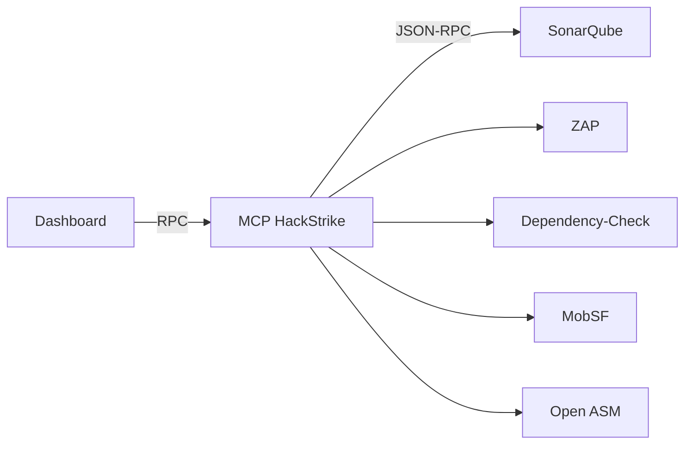
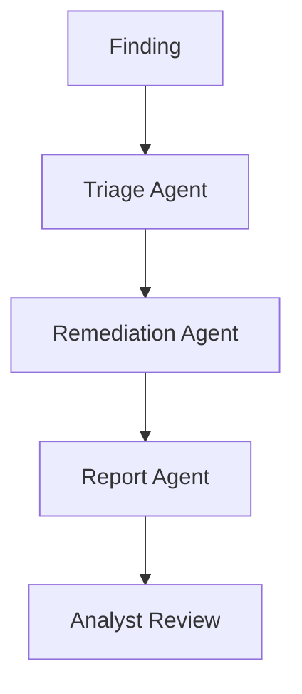

<div align="center">
  
  <br>
  
  
  
  
  
  
  
  
  
  <br>
  
  
  
</div>

# 🛡️ AutoSecForge Pro

**The unified application security dashboard for Kali Linux on WSL2** – integrating SAST, DAST, SCA, mobile security, attack surface management (OASM), MCP-based connector routing, and local OpenAI-compatible agents.

---

## 📋 Table of Contents

- [Quick Start (5 Minutes)](#-quick-start-5-minutes)
- [System Requirements](#-system-requirements)
- [Installation Guide](#-installation-guide)
- [Verify Installation](#-verify-installation)
- [Access the Dashboard](#-access-the-dashboard)
- [Troubleshooting](#-troubleshooting)
- [Key Features](#-key-features)
- [Architecture Diagram](#-architecture-diagram)
- [Service Endpoints](#-service-endpoints)
- [Core Workflow](#-core-workflow)
- [MCP HackStrike Connector Fabric](#-mcp-hackstrike-connector-fabric)
- [Local AI Agents (OpenAI‑compatible)](#-local-ai-agents-openai‑compatible)
- [Reporting & Deliverables](#-reporting--deliverables)
- [Development & Maintenance](#-development--maintenance)
- [Security Hardening](#-security-hardening)
- [License & Contact](#-license--contact)

---

## 🚀 Quick Start (5 Minutes)

### **For Windows Users (WSL2 + Kali)**

```bash
# 1. Install WSL2 and Kali Linux
wsl --install -d kali-linux

# 2. Enter Kali and install Docker
wsl -d kali-linux
curl -fsSL https://get.docker.com -o get-docker.sh
sudo sh get-docker.sh
sudo usermod -aG docker "$USER"
newgrp docker
sudo apt update && sudo apt install -y docker-compose-plugin

# 3. Clone and run AutoSecForge
git clone https://github.com/striketm98/AutoSecForge-AI-Powered-Application-Security-DAST-Platform.git
cd AutoSecForge-AI-Powered-Application-Security-DAST-Platform
docker compose up -d --build

# 4. Wait for services to start (2-3 minutes)
sleep 120
docker compose ps

# 5. Open your browser
# 🌐 Go to: http://localhost:8080
# 📧 Email: admin@cyber-security.local
# 🔑 Password: ChangeMe123!
```

### **For Linux/Mac Users**

```bash
# 1. Ensure Docker is installed
docker --version
docker compose version

# 2. Clone and run
git clone https://github.com/striketm98/AutoSecForge-AI-Powered-Application-Security-DAST-Platform.git
cd AutoSecForge-AI-Powered-Application-Security-DAST-Platform

# 3. Create environment file (optional, but recommended)
cp .env.example .env  # if available

# 4. Start services
docker compose up -d --build

# 5. Check status
docker compose ps

# 6. Open browser: http://localhost:8080
```

---

## 💻 System Requirements

| Component | Minimum | Recommended |
|-----------|---------|-------------|
| **RAM** | 8 GB | 16 GB+ |
| **Disk Space** | 30 GB | 50 GB+ |
| **CPU Cores** | 4 | 8+ |
| **Docker** | 20.10+ | Latest |
| **Docker Compose** | 2.0+ | Latest |
| **OS** | Windows 10/11, Linux, macOS | Windows 11, Ubuntu 22.04+ |

---

## 📦 Installation Guide

### **Step 1: Verify Prerequisites**

```bash
# Check Docker installation
docker --version
# Expected: Docker version 20.10 or higher

# Check Docker Compose
docker compose version
# Expected: Docker Compose version 2.0 or higher

# Check available disk space
df -h /
# Expected: At least 30 GB free
```

### **Step 2: Clone the Repository**

```bash
git clone https://github.com/striketm98/AutoSecForge-AI-Powered-Application-Security-DAST-Platform.git
cd AutoSecForge-AI-Powered-Application-Security-DAST-Platform
```

### **Step 3: Prepare Configuration**

```bash
# Copy example environment (if available)
cp .env.example .env

# Review and customize if needed
cat .env
```

### **Step 4: Start Services**

```bash
# Build and start all services
docker compose up -d --build

# Monitor build progress
docker compose logs -f

# Once complete, check all services are running
docker compose ps
# All containers should show "Up" status
```

### **Step 5: Wait for Full Initialization**

```bash
# Services take 2-3 minutes to fully initialize
# You can check individual service logs:

docker compose logs app          # PHP Dashboard
docker compose logs db           # MySQL Database
docker compose logs sonarqube    # SonarQube
docker compose logs zap          # OWASP ZAP
docker compose logs dependency-check  # Dependency Check
```

---

## ✅ Verify Installation

### **Check All Services Are Running**

```bash
# List all running containers
docker compose ps

# Expected output (all should be "Up"):
# NAME                 STATUS
# app                  Up 2 minutes
# db                   Up 2 minutes
# sonarqube            Up 2 minutes
# zap                  Up 2 minutes
# dependency-check     Up 2 minutes
# mcp-hackstrike       Up 2 minutes
# openai-free-agents   Up 2 minutes
```

### **Test Service Connectivity**

```bash
# Test Dashboard
curl -I http://localhost:8080
# Expected: HTTP/1.1 200 OK

# Test SonarQube
curl -I http://localhost:9000
# Expected: HTTP/1.1 200 OK

# Test OWASP ZAP
curl -I http://localhost:8090
# Expected: HTTP/1.1 200 OK

# Test MCP HackStrike
curl -I http://localhost:6300
# Expected: HTTP/1.1 200 OK
```

### **Check Database Connection**

```bash
# Verify database is accepting connections
docker exec db mysql -u dashboard -pdashboard123 -e "SELECT 1;"
# Expected: Query OK, database connected
```

---

## 🌐 Access the Dashboard

### **Web Interface**

| Service | URL | Credentials |
|---------|-----|-------------|
| **AutoSecForge Dashboard** | `http://localhost:8080` | `admin@cyber-security.local` / `ChangeMe123!` |
| **SonarQube** | `http://localhost:9000` | `admin` / `admin` |
| **OWASP ZAP** | `http://localhost:8090` | Accessible without auth |
| **Dependency-Check** | `http://localhost:8100` | Accessible without auth |
| **MobSF** | `http://localhost:8000` | `admin` / `admin` |
| **MCP HackStrike** | `http://localhost:6300` | No auth (internal) |
| **AI Agents** | `http://localhost:6400` | No auth (internal) |

### **First Login Steps**

1. Open **http://localhost:8080** in your browser
2. Enter credentials:
   - **Email:** `admin@cyber-security.local`
   - **Password:** `ChangeMe123!`
3. Click **Login**
4. **⚠️ IMPORTANT:** Change your password immediately

### **Change Default Password**

1. Click your profile icon (top right)
2. Select **Settings** → **Change Password**
3. Enter new secure password
4. Save changes

---

## 🔧 Troubleshooting

### **Services Not Starting**

```bash
# View detailed logs
docker compose logs --tail=100

# Restart specific service
docker compose restart app

# Rebuild and restart
docker compose up -d --build --force-recreate

# View resource usage
docker stats
```

### **Port Already in Use**

```bash
# Find which process is using the port
lsof -i :8080    # Change port number as needed

# Kill the process
kill -9 <PID>

# Or change the port in docker-compose.yml
# Find the line "8080:8080" and change first number to different port
```

### **Database Connection Failed**

```bash
# Check if database is running
docker compose ps db

# View database logs
docker compose logs db

# Restart database service
docker compose restart db

# Verify credentials
docker exec db mysql -u dashboard -pdashboard123 -e "SHOW DATABASES;"
```

### **Out of Disk Space**

```bash
# Check disk usage
du -sh *

# Clean up Docker images and containers
docker compose down --volumes
docker system prune -a

# Remove old containers
docker container prune
```

### **Memory Issues**

```bash
# View memory usage
docker stats

# Stop and restart with specific memory limits
docker compose down
docker compose up -d --build
```

### **Dashboard Login Loop**

```bash
# Clear browser cookies/cache
# Or try in incognito mode

# Check logs
docker compose logs app

# Restart PHP app
docker compose restart app
```

### **Slow Performance**

```bash
# Check resource limits
docker stats

# View database performance
docker exec db mysql -u dashboard -pdashboard123 -e "SHOW PROCESSLIST;"

# Increase allocated resources if using Docker Desktop
# Settings → Resources → increase CPU/Memory
```

---

## 🚀 Key Features

| Category | Capabilities |
|----------|--------------|
| **AppSec Suite** | SonarQube (SAST), OWASP ZAP (DAST), Dependency‑Check (SCA), MobSF (mobile) |
| **Attack Surface** | Open ASM asset inventory, exposure history, continuous discovery |
| **MCP Fabric** | JSON‑RPC connector mesh: SonarQube, Semgrep, ZAP, Trivy, Dependency‑Check, Open ASM |
| **AI Agents** | Local OpenAI‑compatible `/v1/chat/completions` for triage, remediation, report drafting |
| **Client Management** | Multi‑tenant onboarding, scan job tracking, audit logs |
| **Reporting** | Executive summaries, technical findings, PDF/HTML/Word/Excel/CSV/JSON exports |

---

## 🏗️ Architecture Diagram

```mermaid
flowchart TB
    subgraph Dashboard["Dashboard (PHP/MySQL)"]
        UI["Web UI (Port 8080)"]
        DB["(MySQL tenants/scans/findings)"]
    end

    subgraph MCP["MCP HackStrike (Port 6300)"]
        Router["JSON-RPC Router"]
        Connectors["Connector Catalog"]
    end

    subgraph Tools["Security Tools"]
        Sonar["SonarQube SAST (Port 9000)"]
        ZAP["OWASP ZAP DAST (Port 8090)"]
        DepCheck["Dependency-Check SCA (Port 8100)"]
        MobSF["MobSF Mobile (Port 8000)"]
        ASM["Open ASM (Port 8200)"]
    end

    subgraph AI["OpenAI‑compatible Agents (Port 6400)"]
        Triage["Triage Agent"]
        Remediate["Remediation Agent"]
        Report["Report Agent"]
    end

    UI --> MCP
    UI --> AI
    MCP --> Tools
    AI --> Triage
    AI --> Remediate
    AI --> Report

    style Dashboard fill:#1a1a2e,stroke:#00A86B,stroke-width:2px
    style MCP fill:#0f3460,stroke:#FF4500,stroke-width:2px
    style Tools fill:#16213e,stroke:#e94560,stroke-width:2px
    style AI fill:#533483,stroke:#00A67E,stroke-width:2px
```



---

## 🌐 Service Endpoints

| Service | URL | Purpose |
|---------|-----|---------|
| 🖥️ Dashboard (PHP) | `http://localhost:8080` | Main UI, scan launcher, reporting |
| 🧬 SonarQube (SAST) | `http://localhost:9000` | Code quality & security hotspots |
| 🔍 OWASP ZAP (DAST) | `http://localhost:8090` | Dynamic application scanning |
| 📦 Dependency‑Check (SCA) | `http://localhost:8100` | Third‑party library vulnerabilities |
| 📱 MobSF (Mobile) | `http://localhost:8000` | APK/IPA security analysis |
| 🌍 Open ASM (OASM) | `http://localhost:8200` | Attack surface inventory |
| 🔌 MCP HackStrike | `http://localhost:6300` | JSON‑RPC connector mesh |
| 🤖 OpenAI‑compatible Agents | `http://localhost:6400` | Local AI for triage/remediation/reporting |

---

## 🔄 Core Workflow

1. **Onboard a client** – Create a new tenant in the dashboard.
2. **Launch AppSec suite** – One‑click trigger for SAST, SCA, DAST, mobile, OASM, and AI agents.
3. **MCP HackStrike routes** – The connector fabric dispatches requests to each security tool.
4. **Collect findings** – Scan results are imported, normalised, and stored.
5. **AI enrichment** – Agents generate triage notes, remediation suggestions, and report summaries.
6. **Review & export** – Analysts validate findings, add comments, and export PDF/Word/Excel reports.

---

## 🔌 MCP HackStrike Connector Fabric

The **MCP HackStrike** service implements a lightweight JSON‑RPC mesh over HTTP.

### Endpoints

- `GET /health` – service health
- `GET /connectors` – list available connectors
- `GET /summary` – brief status
- `POST /rpc` – execute a connector call

### Enabled Connectors (configurable)

| Connector | Type | Purpose |
|-----------|------|---------|
| `sonarqube_mcp` | SAST | Pull project quality gates and issues |
| `semgrep_mcp` | SAST | Lightweight static analysis |
| `zap_mcp` | DAST | Trigger active scans, retrieve alerts |
| `trivy_mcp` | Container | Scan image vulnerabilities |
| `dependency-check_mcp` | SCA | Check dependencies for CVEs |
| `openasm_mcp` | OASM | Asset discovery and exposure tracking |

Each connector can be replaced with a production‑grade implementation later without changing the dashboard integration.



---

## 🤖 Local AI Agents (OpenAI‑compatible)

The agent service mimics the OpenAI Chat Completions API – use it with any OpenAI SDK by changing the `base_url`.

### Endpoints

- `GET /health`
- `GET /agents`
- `GET /summary`
- `POST /v1/chat/completions`

### Included Placeholder Agents

| Agent | Function |
|-------|----------|
| **Triage Agent** | Ranks findings by severity and relevance |
| **Remediation Agent** | Generates fix suggestions (code snippets, links) |
| **Report Agent** | Writes executive summaries and technical descriptions |

You can later replace the backend with **Ollama**, **vLLM**, **OpenChat**, or a real OpenAI endpoint while keeping the same API shape.



---

## 📊 Reporting & Deliverables

The dashboard supports:

- **Executive summary** – automatically generated by the Report Agent.
- **Technical findings table** – with CWE mapping, severity, remediation notes.
- **Export formats**: PDF (printable HTML), Word, Excel, CSV, JSON.
- **Evidence attachments** – scan logs, screenshots, raw JSON.

Reports can be generated per client and saved to the local filesystem or downloaded directly.

---

## 🛠️ Development & Maintenance

### View Logs

```bash
docker compose logs -f app
docker compose logs -f mcp-hackstrike
docker compose logs -f openai-free-agents
```

### Restart a Specific Service

```bash
docker compose restart app
```

### Stop Everything

```bash
docker compose down
```

### Database Schema

The initial schema is located at `database/schema.sql`. It creates tables for clients, scans, findings, and reports.

### Customisation

- PHP backend: `public/` and `src/`
- MCP HackStrike source: `mcp-hackstrike/`
- AI agents source: `openai-free-agents/`
- Docker Compose configuration: `docker-compose.yml`

---

## 🔐 Security Hardening

For production deployments, **always** apply these measures:

1. **Change all default passwords** – dashboard admin, SonarQube, ZAP, MySQL, MobSF.
2. **Use strong secrets** – generate passwords with `openssl rand -base64 32`.
3. **Enable HTTPS** – place behind a reverse proxy (Traefik, Nginx) with TLS certificates.
4. **Isolate the network** – do not expose internal ports to the internet.
5. **Regular updates** – `docker compose pull && docker compose up -d`
6. **Audit logs** – monitor failed login attempts and API calls.

> See [SECURITY.md](SECURITY.md) for the vulnerability disclosure policy.

---

## 📄 License & Contact

AutoSecForge Pro is released under a **commercial Enterprise License**.
See [LICENSE.md](LICENSE.md) for full terms.

**Contact:** `mazumdertamal81@gmail.com`
**Documentation:** [AutoSecForge Pro Docs](https://tamalkantimazumder.netlify.app/AutoSecForgePRo)

---

<div align="center">
  <hr width="60%">
  <strong>Built with ❤️ for security professionals.</strong><br>
  <sub>AutoSecForge Pro – Unified, AI‑ready, and Docker‑native.</sub>
  <br><br>
  <a href="#autosecforge-pro">⬆ Back to Top</a>
</div>
