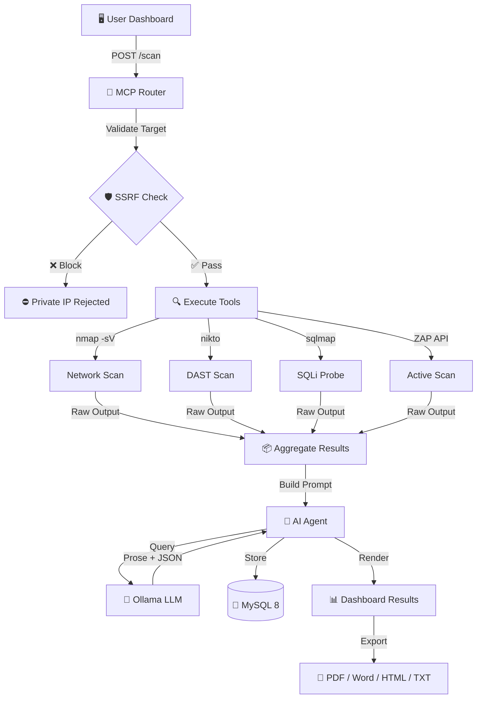

<div align="center">

<!-- Animated Header Banner -->


<br>

<!-- Premium Badge Row -->
<p>
  
  
  
  
</p>

<p>
  
  
  
  
  
  
</p>

<!-- Hero Tagline -->
<h3>
  
</h3>

<p><em>Orchestrates industry-standard security tools with <strong>local AI triage</strong> — your data never leaves your infrastructure.</em></p>

<!-- Quick Navigation Pills -->
<p>
  <a href="#-key-features"></a>
  <a href="#-architecture"></a>
  <a href="#-installation"></a>
  <a href="#-configuration"></a>
  <a href="#-troubleshooting"></a>
</p>

</div>

---

<!-- Legal Notice Banner -->
<div align="center">


</div>

> **Legal Notice:** AutoSecForge automates active security scanning. Only scan targets you **own** or have **explicit written permission** to test. Unauthorized scanning may violate local, national, and international laws. This tool is intended for authorized security professionals, red teams, and compliance auditors.

---

## ⚡ Key Features

<div align="center">

|  |  |  |
|:---:|:---:|:---:|
| **Local Ollama LLM** analyzes raw scan output, produces executive summaries, severity-ranked findings, and remediation guidance. Emits structured JSON (severity/CVSS/CWE/CVE/remediation) stored in the database. OpenAI-compatible API (`/v1/chat/completions`). | **One-click execution** of nmap, nikto, sqlmap, and OWASP ZAP in isolated containers. Aggregated output fed to AI for intelligent triage. | **Trivy integration** — enter any image (e.g., `nginx:1.25`) and receive CVE findings with AI-assisted risk analysis. |

|  |  |  |
|:---:|:---:|:---:|
| **MobSF integration** — drag-and-drop APK/IPA/XAPK for static analysis, severity-tagged findings, native PDF reports, and full pipeline integration. | **SonarQube integration** — upload source `.zip` archives, run `sonar-scanner`, map issues to findings with AI triage. | **Branded PDF & Word (.doc)** deliverables with cover pages, risk ratings, severity summaries, findings tables, per-finding remediation, AI narrative, and raw-output appendices. Also HTML preview and plain-text export. |

|  |  |  |
|:---:|:---:|:---:|
| **AdminLTE 3.2** dark-indigo UI with live KPI cards, scan trend charts, status donuts, real-time tool-health grids, and recent activity feeds. | **Six distinct roles** (admin, manager, analyst, client, auditor, executive) with role-gated navigation and data scoping. | **SSRF guards** (private-IP rejection at PHP and MCP layers), rate limiting, security headers, hardened `.htaccess`, allow-listed scan flags, and zip-slip protection. |

|  | | |
|:---:|:---:|:---:|
| `host.docker.internal:host-gateway` mapping ensures identical operation on Docker Desktop, WSL2 Docker Engine, and Kali-in-WSL. | | |

</div>

---

## 🏗️ Architecture

<div align="center">

```
┌─────────────────────────────────────────────────────────────────────────────┐
│                                                                             │
│   🌐  Browser → https://autosecforge.com   (HTTPS only · IP access 403)      │
│                                                                             │
└───────────────────────────┬─────────────────────────────────────────────────┘
                            │
              ┌─────────────▼─────────────┐
              │    🖥️  APP (PHP 8.3)      │
              │    Apache + AdminLTE 3.2   │
              │         🎨  Dashboard      │
              └─────────────┬─────────────┘
                            │ POST /scan/security-review
                            │
              ┌─────────────▼─────────────┐
              │  🔧  MCP Router :6300     │
              │   Node/Express            │
              │   Orchestrator            │
              └─────────────┬─────────────┘
                            │
           ┌────────────────┼────────────────┐
           │                │                │
    ┌──────▼──────┐  ┌─────▼──────┐  ┌──────▼──────┐
    │ 🔍  nmap    │  │ 🕷️  nikto  │  │ 💉  sqlmap  │
    │   Network   │  │    DAST    │  │    SQLi     │
    └─────────────┘  └────────────┘  └─────────────┘
           │                │                │
           │    ┌───────────▼───────────┐    │
           │    │   🛡️  OWASP ZAP :8090 │    │
           │    │    Deep Spider +       │    │
           │    │    Active Scan         │    │
           │    └───────────┬───────────┘    │
           │                │                │
           └────────────────┼────────────────┘
                            │ Aggregated Output
              ┌─────────────▼─────────────┐
              │  🤖  AI Agent :6400       │
              │   Flask / OpenAI-Compat   │
              │   Triage Engine           │
              └─────────────┬─────────────┘
                            │
              ┌─────────────▼─────────────┐
              │   🧠  Ollama :11434       │
              │    Local LLM Inference    │
              │    Zero Cloud Exposure    │
              └───────────────────────────┘

  📦  Direct Connections:  MobSF :8000  ←→  App (Mobile Upload)
  🔒  Internal-Only:  ZAP · SonarQube · sonar-scanner · MobSF · Trivy · OASM
```

</div>

### 📊 Data Flow: Security Review



### 🔀 Other Scan Flows

<div align="center">

| Flow | Entry Point | Pipeline |
|:----:|:-----------:|:--------:|
| **📦 Container SCA** | `scan_trigger.php` (image form) | `mcp-router /scan/container` → `trivy image` → AI triage |
| **📱 Mobile** | `mobsf.php` (file upload) | MobSF REST API (`/upload` → `/scan` → `/scorecard`) → findings + triage; PDF proxied via `mobsf.php?pdf=<hash>` |
| **💻 SAST** | `sast.php` (source zip) | Unzip to `sast-src` → `mcp-router /scan/sast` → `sonar-scanner` → SonarQube API → findings + triage |

</div>

---

## 🔌 Service & Port Reference

<div align="center">


</div>

> **Design Principle:** Only the dashboard is reachable from the host, bound exclusively to `127.0.0.1` over HTTPS. All other services are **internal-only** on the `asf-net` Docker network.

<div align="center">

| Service | Container | 🔓 Host Reachable | Internal Port | Purpose |
|:--------|:----------|:-----------------:|:-------------:|:--------|
| 🖥️ **Dashboard** (PHP/Apache) | `autosecforge-app` | ✅ `127.0.0.1:443` (HTTPS) + `:80` redirect | 443 / 80 | Web UI — domain only |
| 🗄️ **MySQL 8.4** | `autosecforge-db` | ❌ Internal only | 3306 | Persistence layer |
| 🧠 **Ollama** | `autosecforge-ollama` | ❌ Internal only | 11434 | Local LLM inference |
| 🤖 **AI Agent** (Flask) | `autosecforge-ai-agent` | ❌ Internal only | 6400 | Triage + OpenAI-compatible API |
| 🔧 **MCP Router** (Node) | `autosecforge-mcp-router` | ❌ Internal only | 6300 | Scan orchestration |
| 🔍 **nmap** | `autosecforge-nmap` | ❌ Internal only | — | Network scanning (exec target) |
| 🕷️ **nikto** | `autosecforge-nikto` | ❌ Internal only | — | Web scanning (exec target) |
| 💉 **SQLMap** | `autosecforge-sqlmap` | ❌ Internal only | — | SQL injection (exec target) |
| 🗺️ **OASM** | `autosecforge-oasm` | ❌ Internal only | 6200 | Attack-surface mapping |
| 🛡️ **OWASP ZAP** | `autosecforge-zap` | ❌ Internal only | 8090 | DAST daemon |
| 📊 **SonarQube CE** | `autosecforge-sonarqube` | ❌ Internal only | 9000 | SAST platform |
| 📱 **MobSF** | `autosecforge-mobsf` | ❌ Internal only | 8000 | Mobile app security |
| 📦 **Trivy Server** | `autosecforge-trivy` | ❌ Internal only | 8081 | Container/SCA scanning |

</div>

> 💡 **Pro Tip:** Need a tool's web UI (e.g., SonarQube) during setup? **Never** publish its port. Use SSH tunneling:
> ```bash
> ssh -L 9000:localhost:9000 <host>
> ```
> Never add a public `ports:` mapping in production.

---

## 📋 Prerequisites

<div align="center">

| Requirement | Specification | Status |
|:------------|:--------------|:------:|
| **Operating System** | Windows 10 21H2+ / Windows 11 (virtualization enabled in BIOS), or Linux with Docker Engine 24+ | ✅ Required |
| **Memory** | 8 GB RAM minimum; **16 GB recommended** | ⚠️ Critical |
| **Disk Space** | ~20 GB free (container images + LLM model weights) | ✅ Required |
| **GPU** | Optional — NVIDIA GPU with CUDA + `nvidia-container-toolkit` | 🚀 Optional |

</div>

---

## 🚀 Installation

<div align="center">


</div>

### Step 1 — Install WSL2 (Windows Host)

Open **PowerShell as Administrator**:

```powershell
# Enable WSL2
wsl --install --no-distribution

# Reboot when prompted, then set default version
wsl --set-default-version 2
```

### Step 2 — Install Kali Linux

```powershell
wsl --install -d kali-linux
```

Launch Kali, create your UNIX user, then update the system:

```bash
sudo apt update && sudo apt full-upgrade -y
```

### Step 3 — Install Docker Engine

```bash
# Install dependencies
sudo apt install -y ca-certificates curl gnupg

# Add Docker repository (Kali tracks Debian bookworm)
sudo install -m 0755 -d /etc/apt/keyrings
curl -fsSL https://download.docker.com/linux/debian/gpg |   sudo gpg --dearmor -o /etc/apt/keyrings/docker.gpg

echo "deb [arch=$(dpkg --print-architecture) signed-by=/etc/apt/keyrings/docker.gpg]   https://download.docker.com/linux/debian bookworm stable" |   sudo tee /etc/apt/sources.list.d/docker.list > /dev/null

# Install Docker
sudo apt update
sudo apt install -y docker-ce docker-ce-cli containerd.io   docker-buildx-plugin docker-compose-plugin

# Run Docker without sudo
sudo usermod -aG docker $USER
newgrp docker

# Enable systemd for WSL2
sudo tee -a /etc/wsl.conf > /dev/null <<'EOF'
[boot]
systemd=true
EOF
```

Restart WSL from **PowerShell**:
```powershell
wsl --shutdown
```

Reopen Kali and verify:
```bash
sudo systemctl enable --now docker
docker version && docker compose version
```

> **Alternative:** Install **Docker Desktop for Windows** with the WSL2 backend and enable Kali integration under *Settings → Resources → WSL Integration*. Steps 4+ remain identical.

### Step 4 — Clone the Project

```bash
# From inside Kali
git clone <your-repo-url> AutoSecForge-V.2
cd AutoSecForge-V.2

# Or, if the project lives on the Windows side:
cd /mnt/c/Users/<you>/Downloads/AutoSecForge-V.2
```

### Step 5 — Configure Environment

```bash
# Copy environment templates
cp .env.example .env
cp public/.env.example public/.env

# Edit secrets (change DB_PASSWORD, DB_ROOT_PASSWORD, ZAP_API_KEY)
nano public/.env
```

> 🔐 `.env` files are **git-ignored** — secrets never enter version control.

### Step 5b — Map the Domain (Required)

The application **only answers to `https://autosecforge.com`**. Add the hosts entry:

**Linux / Kali / macOS:**
```bash
echo "127.0.0.1 autosecforge.com" | sudo tee -a /etc/hosts
```

**Windows (PowerShell as Administrator):**
```powershell
Add-Content -Path "$env:WINDIR\System32\drivers\etc\hosts" `
  -Value "`n127.0.0.1 autosecforge.com"
```

> ⛔ Accessing by IP (`https://127.0.0.1`) is intentionally blocked with `403 Forbidden`.

### Step 6 — Build and Launch

```bash
# Build and start all services
docker compose up -d --build

# Verify all services are healthy
docker compose ps
```

First build takes **5–15 minutes** (image pulls + builds). MySQL auto-loads `database/schema.sql` on first boot, including the default admin account.

### Step 7 — Pull a Local AI Model

```bash
# Small/low-RAM boxes (recommended default, ~1 GB):
docker exec autosecforge-ollama ollama pull qwen2.5:1.5b

# Larger machines (≥8 GB) can use llama3:
# docker exec autosecforge-ollama ollama pull llama3
# Set OLLAMA_MODEL in public/.env to match
```

### Step 8 — First Login

Browse to **https://autosecforge.com** and log in. The image ships a **self-signed certificate** — accept the browser warning once, or install a real certificate (see [Security Hardening](#-security-hardening)).

<div align="center">

| Field | Value |
|:-----:|:-----:|
| **URL** | `https://autosecforge.com` |
| **Email** | `admin@autosecforge.local` |
| **Password** | `Admin@123` |

</div>

> 🔐 **Change this password immediately** (avatar menu → Change Password).

---

## 🧠 Ollama Local AI Setup

<div align="center">


</div>

All AI inference runs **locally** — nothing is sent to any cloud provider.

### Model Selection Matrix

Set `OLLAMA_MODEL` in `public/.env`, then run `docker compose restart ai-agent`.

<div align="center">

| Model | Pull Command | RAM Needed | Best For |
|:-----:|:-----------|:----------:|:---------|
| `qwen2.5:1.5b` ⭐ | `ollama pull qwen2.5:1.5b` | ~1–2 GB | **Default** — fits 3.8 GB boxes |
| `qwen2.5:0.5b` | `ollama pull qwen2.5:0.5b` | ~0.5 GB | Severely constrained systems |
| `phi3:mini` | `ollama pull phi3:mini` | ~4 GB | Low-RAM machines |
| `mistral` | `ollama pull mistral` | ~6 GB | Faster, lighter inference |
| `llama3` | `ollama pull llama3` | ~8 GB | Best quality; **OOMs on <5 GB** |
| `qwen2.5:14b` | `ollama pull qwen2.5:14b` | ~12 GB | Premium quality triage |

</div>

> ⚠️ **OOM Warning:** If you see `llama-server process has terminated: signal: killed` and a 500 from `/api/chat`, the model is too large for available RAM — switch to a smaller model.

Run pulls inside the container:
```bash
docker exec autosecforge-ollama ollama pull <model>
```

### GPU Acceleration (NVIDIA)

1. Install `nvidia-container-toolkit` in Kali
2. Uncomment the `deploy.resources` GPU stanza under the `ollama` service in `docker-compose.yml`
3. Run `docker compose up -d ollama`

### Verify the AI Pipeline

```bash
# List installed models
docker exec autosecforge-ollama ollama list

# Check AI agent health
docker exec autosecforge-mcp-router wget -qO- http://ai-agent:6400/health
# Expected: {"status":"ok",...}

# Check MCP router health
docker exec autosecforge-mcp-router wget -qO- http://localhost:6300/health
# Expected: {"status":"ok",...}
```

The AI agent exposes an **OpenAI-compatible endpoint** at `http://ai-agent:6400/v1/chat/completions` on the internal network. Any containerized OpenAI-SDK tool can point at it with a dummy API key. It is deliberately **not** published to the host.

---

## 👥 Role-Based Access Control

<div align="center">

| Role | 🖥️ Dashboard | ⚡ Trigger Scans | 📋 View All Jobs | 📊 Reports | 👤 Client/User Mgmt | 🔍 Audit Log |
|:----:|:-----------:|:---------------:|:----------------:|:----------:|:--------------------:|:------------:|
| **admin** | ✅ Full | ✅ All | ✅ All | ✅ All | ✅ Full | ✅ Full |
| **manager** | ✅ Full | ✅ All | ✅ All | ✅ All | ✅ Clients only | ✅ Full |
| **analyst** | ✅ Full | ✅ Own | ✅ Own jobs | ✅ Own reports | ❌ | ❌ |
| **auditor** | ✅ Full | ❌ | ✅ Read-only | ✅ Read-only | ❌ | ✅ Full |
| **client** | ✅ Scoped | ❌ | ✅ Own projects | ✅ Own projects | ❌ | ❌ |
| **executive** | ✅ Summary KPIs | ❌ | ✅ Read-only | ✅ Read-only | ❌ | ❌ |

</div>

- Roles stored in the `users` table; admins manage accounts from **Management → Users**
- Sidebar sections (Scanning / Reporting / Management / System) render only for permitted roles
- Every privileged action is written to `audit_log` with user, action, and timestamp

---

## ⚡ Running a Security Review

<div align="center">


</div>

| Step | Action | Details |
|:----:|:-------|:--------|
| **1** | Navigate to **Scanning → Security Review** (`scan_trigger.php`) | |
| **2** | Enter a target | Public hostname, IP, or URL. Private/internal ranges (`10.x`, `172.16–31.x`, `192.168.x`, `127.x`, link-local) are **rejected by design** |
| **3** | Select modules | 🔍 **Network** — `nmap -sV -T4 --open` service discovery<br>🕷️ **DAST** — `nikto` web server scan<br>💉 **SQLi** — `sqlmap --batch` injection probe<br>🛡️ **OWASP ZAP** — spider + bounded active scan (deeper, slower) |
| **4** | Click **Run Security Review** | Progress steps display while tools execute and AI triages |
| **5** | Review results | **AI analysis** (executive summary, findings by severity, remediation) + collapsible **raw tool output** panel with copy/export |
| **6** | Access history | Job saved to **Scanning → Scan History**; findings flow to **Findings Review**; exportable as PDF/Word |

### Other Scanners

<div align="center">

| Scanner | Path | Input | Requirements |
|:-------:|:----:|:-----:|:------------:|
| 📦 **Container SCA (Trivy)** | Same page | Image name (e.g., `nginx:1.25`) | — |
| 📱 **Mobile Scan (MobSF)** | `Scanning → Mobile Scan` | APK/IPA/XAPK file | `MOBSF_API_KEY` |
| 💻 **Code Analysis (SonarQube)** | `Scanning → Code Analysis` | Source `.zip` | `SONAR_TOKEN` |

</div>

---

## 📊 Reporting & Export

<div align="center">


</div>

- **Reporting → Reports** (`report.php`) lists every completed review; **Preview** opens the AI analysis + evidence in a modal
- **Export** offers four formats via `?export=<job-id>&format=…`:

<div align="center">

| Format | Icon | Description |
|:------:|:----:|:------------|
| **PDF** | 📄 | Branded deliverable with cover page, risk rating, severity summary, findings table, per-finding remediation, AI narrative, and raw appendix. Falls back to print-to-PDF if `wkhtmltopdf` unavailable. |
| **DOC** | 📝 | Word-openable `.doc` (Office HTML) — same layout, fully editable. |
| **HTML** | 🌐 | In-browser preview of the complete report. |
| **TXT** | 📃 | Plain-text format for ticketing systems. |

</div>

- **Reporting → Deliverables** (`deliverables.php`) aggregates all reports with per-report download buttons and portfolio stats (total reports, findings, critical/high counts)
- **Audit Log** (`audit.php`, admins/auditors) — complete trail of logins, scans, exports, user/client changes
- The renderer lives in `src/report_render.php` and is shared by all export formats

---

## ⚙️ Configuration Reference

`.env` (root, for compose/MySQL) and `public/.env` (mounted into the app) — **keep shared keys identical**:

<div align="center">

| Variable | Default | Description |
|:---------|:--------|:------------|
| `DB_HOST` / `DB_PORT` | `db` / `3306` | MySQL container address |
| `DB_NAME` | `security_dashboard` | Schema name |
| `DB_USER` / `DB_PASSWORD` | `dashboard` / *change me* | App DB credentials |
| `DB_ROOT_PASSWORD` | *change me* | MySQL root (compose healthcheck) |
| `OLLAMA_MODEL` | `qwen2.5:1.5b` | Model the AI agent uses. `llama3` (8B) needs ~5–6 GB RAM; use `qwen2.5:1.5b` (~1 GB) on small/3.8 GB boxes |
| `MCP_URL` | `http://mcp-router:6300` | Orchestrator endpoint |
| `AI_AGENT_URL` | `http://ai-agent:6400` | AI triage endpoint |
| `OASM_URL` | `http://oasm:6200` | Attack-surface service |
| `SQLMAP_URL` | `http://sqlmap:6000` | SQLMap API |
| `ZAP_API_KEY` | *change me* | ZAP daemon API key (shared by `zap` service + `mcp-router`) |
| `MOBSF_API_KEY` | *change me* | MobSF REST API key — **must match** on `mobsf` and `app` services; required for Mobile Scan |
| `SONAR_TOKEN` | *change me* | SonarQube token for SAST (create in SonarQube ▸ My Account ▸ Security) |

</div>

---

## 🔄 Updating an Existing Deployment

When pulling a build that changes images or adds services:

```bash
cd /opt/AutoSecForge-V.2          # Your deploy path
git pull                          # Preserves .env / public/.env (git-ignored)

# Add any new keys to .env: MOBSF_API_KEY, SONAR_TOKEN, OLLAMA_MODEL

docker compose up -d --build app mcp-router ai-agent
docker compose up -d sonar-scanner
docker exec autosecforge-ollama ollama pull qwen2.5:1.5b
```

> ⚠️ On a 3.8 GB box, SonarQube (Elasticsearch) + Ollama together is tight — monitor `docker stats` for OOM during SAST runs.

---

## 🔧 Troubleshooting

<div align="center">


</div>

<div align="center">

| Symptom | 🔍 Root Cause | 🔧 Fix |
|:--------|:-------------|:-------|
| `autosecforge.com` won't resolve | Missing hosts entry | Add entry from [Step 5b](#step-5b--map-the-domain-required). On WSL2, edit the **Windows** hosts file, not Kali's. |
| Browser shows `403 Forbidden` | IP or wrong hostname access | Use `https://autosecforge.com` exactly. Raw-IP access is blocked by design. |
| Certificate warning | Self-signed certificate | Expected — accept once, or install a CA-signed certificate (see [Security Hardening](#-security-hardening)). |
| Dashboard unreachable | App container restarting | `docker compose ps` → `docker compose logs app`. Confirm hosts entry maps to `127.0.0.1`. |
| Login fails with DB error | DB still initializing | Wait for `db` to report *healthy*. To rebuild schema: `docker compose down -v && docker compose up -d` (**destroys data**). |
| `PDOException: Access denied` | Password mismatch between `.env` files | Ensure root `.env` and `public/.env` are identical. If changed after first boot, re-init DB: `docker compose down && docker volume rm autosecforge-v2_mysql-data && docker compose up -d` (keeps Ollama models). |
| AI analysis "triage unavailable" | Model not pulled | `docker exec autosecforge-ollama ollama pull <model>`. Verify with `curl localhost:11434/api/tags`. |
| AI responses extremely slow | CPU inference bottleneck | Switch to `phi3:mini`/`mistral`, or enable GPU stanza. |
| "Invalid or private target" | SSRF guard triggered | Working as intended — test against authorized targets (e.g., `scanme.nmap.org`). |
| MCP router can't reach tools | Docker socket or container issue | Confirm `/var/run/docker.sock` is mounted and tool containers are **Up** (`docker compose ps`). |
| SonarQube `vm.max_map_count` error | Kernel parameter too low | `sudo sysctl -w vm.max_map_count=262144` (persist in `/etc/sysctl.conf`). |
| Port 80/443 already in use | Conflicting web server | Stop the conflicting service, or change loopback host port in `docker-compose.yml` (e.g., `"127.0.0.1:8443:443"`) and browse `https://autosecforge.com:8443`. |
| WSL clock drift breaks TLS/apt | Hyper-V time sync issue | `sudo hwclock -s` or restart WSL (`wsl --shutdown`). |

</div>

**View logs for any service:**
```bash
docker compose logs -f <service>    # e.g., app, mcp-router, ai-agent, ollama
```

---

## 🛡️ Security Hardening

<div align="center">


</div>

Before any non-lab deployment:

| # | Action | Priority |
|:-:|:-------|:--------:|
| 1 | **Rotate every default credential** — admin password, `DB_PASSWORD`, `DB_ROOT_PASSWORD`, `ZAP_API_KEY` | 🔴 Critical |
| 2 | **Maintain domain-lock and loopback binding** — App ports bind to `127.0.0.1` only; Apache 403s any non-`autosecforge.com` Host. Only the app is host-reachable; all other services are internal to `asf-net`. | 🔴 Critical |
| 3 | **Replace the self-signed certificate** — Mount a CA-signed cert/key over `/etc/ssl/asf/` (e.g., volume `./ssl/autosecforge.crt:/etc/ssl/asf/autosecforge.crt:ro`) or terminate TLS at a reverse proxy. | 🟡 High |
| 4 | **Protect the MCP router** — It mounts the Docker socket (read-only) to exec into tool containers — treat it as privileged. It has no host port and must stay that way. | 🔴 Critical |
| 5 | **Preserve `.htaccess` protections** — It denies `.env`/`.git`, sets security headers, and default-denies PHP outside the allow-list. | 🟡 High |
| 6 | **Do not relax SSRF guards** — Private-IP filters exist at both PHP and Node layers. | 🔴 Critical |
| 7 | **Review `audit_log` regularly** — The auditor role exists for exactly this purpose. | 🟡 High |

---

## 📁 Project Structure

```
AutoSecForge-V.2/
├── 🐳 docker-compose.yml        # Full stack definition
├── 🐳 Dockerfile                # PHP 8.3 + Apache app image
├── 📂 database/
│   └── 🗄️ schema.sql            # Users (RBAC), projects, scan_jobs, findings, audit_log, clients
├── 📂 public/                   # Web root
│   ├── 🏠 home.php              # Dashboard (KPIs, charts, tool health)
│   ├── ⚡ scan_trigger.php      # Security review launcher + ZAP/Trivy container SCA
│   ├── 📱 mobsf.php             # Mobile scan via MobSF + native PDF proxy
│   ├── 💻 sast.php              # Code analysis via SonarQube
│   ├── 📋 scan_jobs.php         # Job history + detail modal
│   ├── 🔍 review.php            # Findings Review (filters + status workflow)
│   ├── 📊 report.php            # Reports + PDF/Word/HTML/TXT export
│   ├── 📦 deliverables.php      # Deliverables hub (all reports + downloads)
│   ├── 👥 clients.php           # Client account management
│   ├── ⚙️ settings.php          # Profile + team/user management + system info
│   ├── 🔌 addons.php            # Modules — live service-health dashboard
│   ├── ✅ checklist.php         # Compliance — OWASP Top 10 coverage matrix
│   ├── 🔍 audit.php             # Audit log viewer
│   ├── 📂 api/                  # JSON endpoints (stats, recent_scans,
│   │                            #   trigger_scan, ai_analyze)
│   └── 🔒 .htaccess             # Security headers + PHP allow-list
├── 📂 views/partials/           # AdminLTE 3.2 header/footer layout
├── 📂 src/                      # Core libraries
│   ├── 🗄️ Database.php          # PDO wrapper
│   ├── 🔐 auth.php              # RBAC implementation
│   ├── 🛠️ helpers.php           # asf_audit and utilities
│   └── 📄 report_render.php     # Shared PDF/Word/HTML renderer
├── 📂 ai-agent/                 # 🤖 Flask service → Ollama
│                                #   (triage + structured findings)
├── 📂 mcp-server/               # 🔧 Express orchestrator
│                                #   (nmap/nikto/sqlmap/ZAP/Trivy/SAST)
├── 📂 tool-wrappers/            # Dockerfiles/APIs for nmap, nikto, sqlmap,
│                                #   oasm, pentest
├── 📝 NOTE.md                   # Operational troubleshooting runbook
└── 📂 Documents/                # Architecture diagrams, client runbook,
                                 #   SAST report templates
```

---

<div align="center">

<!-- Animated Footer -->


<br>

**AutoSecForge Pro v12.1** — Built for authorized security testing.

© 2026 Tamal Kanti Mazumder

<p>
  
  
  
</p>

</div>
