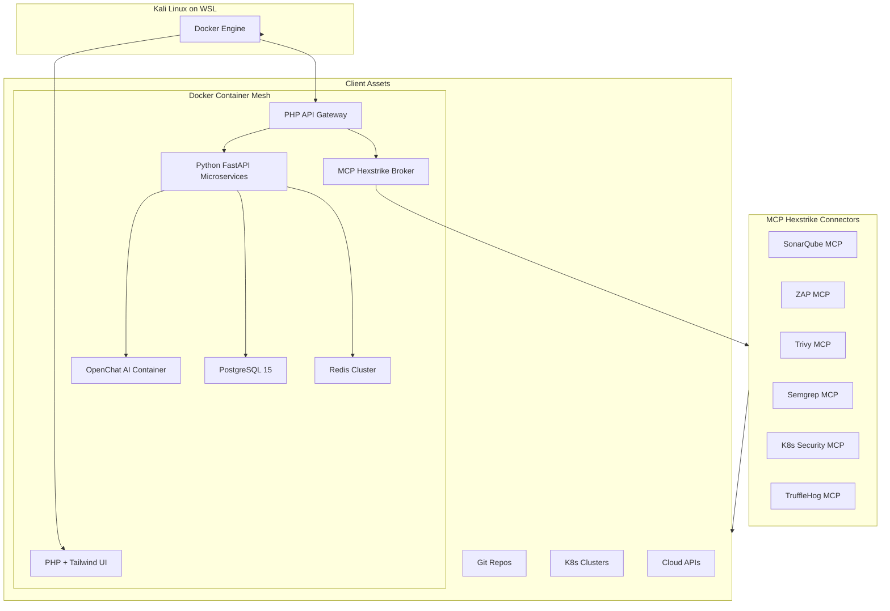
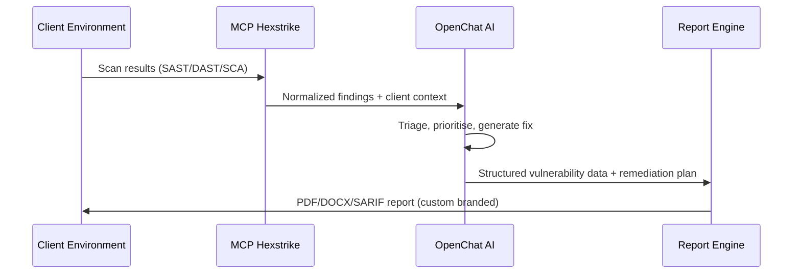

<div align="center">
🛡️ AutoSecForge Pro
<p align="center">
  
  
  
  
  
  
  
  
</p>
<p align="center">
  <strong>Agentic AI Security Platform – Built on Kali + WSL + Docker, Powered by OpenChat AI</strong><br>
  <em>Unified AppSec, ProdSec, and Attack Surface Management with Per‑Client Report Automation</em>
</p>
<p align="center">
  <a href="#-platform-overview">Overview</a> •
  <a href="#-system-architecture">Architecture</a> •
  <a href="#-core-capabilities--pro-addons">Pro Capabilities</a> •
  <a href="#-mcp-hexstrike-connector-fabric">MCP Hexstrike</a> •
  <a href="#-deployment--initialization">Deployment</a> •
  <a href="#-v220-whats-new">v2.2.0 Highlights</a>
</p>
</div>

---

## ⚡ Platform Overview

**AutoSecForge Pro** delivers the first **agentic AI security orchestration platform** that runs natively on **Kali Linux inside WSL**, leverages **Docker containers** for all services, and uses **OpenChat AI** as the reasoning engine. The platform consolidates SAST, DAST, SCA, container security, and open attack surface management into a single pane of glass – with **per‑client report generation** that matches your MSSP or enterprise requirements.

> 🎯 **Mission:** Reduce MTTR by 80% using AI‑native automation while keeping full control inside your Kali/WSL environment.

### Why This Stack?
| Component | Role in AutoSecForge Pro |
|-----------|---------------------------|
| **Kali Linux (WSL)** | Host OS with pre‑integrated security tools (Nmap, Metasploit, Burp, etc.) |
| **Docker** | Container runtime for microservices, MCP connectors, and OpenChat AI |
| **MCP Hexstrike** | High‑performance Model Context Protocol mesh – connects scanners to AI |
| **OpenChat AI** | Fine‑tuned 7B/13B LLM for threat triage, patch generation, and report writing |
| **PHP/Python/Go** | Backend services orchestrated via Docker Compose |

---

## 🏗️ System Architecture



### Data Flow (Client‑Aware Reporting)


---

## 🛡️ Core Capabilities & Pro Add‑ons

### AppSec / ProdSec
| Capability | Implementation | Status |
|------------|---------------|--------|
| **Multi‑Scanner Normalization** | MCP Hexstrike unifies SonarQube, ZAP, Trivy, Semgrep | ✅ Live |
| **AI False‑Positive Elimination** | OpenChat 13B with fine‑tuned security dataset | ✅ Live |
| **Auto‑PR Remediation** | OpenChat generates patches → GitHub/GitLab PR | ✅ Live |
| **Per‑Client Report Generation** | Templated (PDF/DOCX/Excel) with client logo, custom findings | 🆕 Pro |

### Attack Surface Management (OASM)
| Feature | How it works |
|---------|---------------|
| **Kali Tool Integration** | Launch Nmap, Nikto, or Nuclei scans directly from dashboard |
| **Continuous Discovery** | DNS/Certificate transparency + API spidering |
| **Risk Scoring** | CVSS + exploitability (EPSS) + business context |

### Kubernetes & Cloud Security
| Feature | Status |
|---------|--------|
| **K8s Runtime Monitoring** | eBPF via Cilium + Falco (containerised) |
| **CSPM for AWS/Azure/GCP** | MCP connectors to Security Hub, Defender, etc. |
| **OPA/Gatekeeper Integration** | Policy as code, auto‑remediation on violation |

### OpenChat AI – Security Tuning
- **Base model:** OpenChat 3.6 (7B/13B) fine‑tuned on CVE descriptions, exploit code, and remediation patterns.
- **In‑context learning:** Each client gets a project‑specific prompt with their tech stack, compliance requirements, and past findings.
- **Report generation:** OpenChat writes executive summaries, technical appendices, and remediation steps – in the client’s preferred language and tone.

---

## 🔌 MCP Hexstrike Connector Fabric

**MCP Hexstrike** is our custom‑built, high‑throughput JSON‑RPC mesh that replaces one‑off integrations. It runs as a Docker container and supports **hot‑loading connectors**.

| Connector | Type | Purpose |
|-----------|------|---------|
| `SonarQube` | SAST | Code quality, security hotspots |
| `OWASP ZAP` | DAST | Active/passive scanning |
| `Trivy` | Container | Image & filesystem vulns |
| `Semgrep` | SAST | Lightweight polyglot analysis |
| `TruffleHog` | Secrets | Entropy‑based secret detection |
| `K8s Security` | Runtime | Cluster misconfigs, privilege escalation |
| `AWS Security Hub` | CSPM | GuardDuty, Inspector, Macie findings |
| `GitHub Advanced Security` | SCM | Secret scanning, code scanning, Dependabot |

> 💡 **Custom Connectors:** You can add any CLI tool (Nmap, Nuclei, Gitleaks) by wrapping it in a simple MCP adapter.

---

## 🎨 Enterprise UI/UX

```
┌─────────────────────────────────────────────────────────────────────────────┐
│  AutoSecForge Pro – [Client: ACME Corp]                         [AI Copilot] │
│  [Dashboard] [Attack Surface] [AppSec] [K8s] [Reports] [Settings]           │
├─────────────────────────────────────────────────────────────────────────────┤
│  🚨 Critical (2)  🔴 High (7)  🟠 Medium (23)  🔵 Low (45)                   │
│  ┌─────────────────────────────────┐  ┌───────────────────────────────────┐  │
│  │  OpenChat AI – Live Triage       │  │  Recent Reports                   │  │
│  │  "CVE-2025-1234 in Spring Boot   │  │  • PCI DSS Q2 – 02 Apr 2026.pdf   │  │
│  │    affects 3 services. Auto-PR   │  │  • SOC2 Type II – 15 Mar 2026.docx│  │
│  │    created in repo 'payment-api' │  │  • SBOM export – 01 Apr 2026.json │  │
│  └─────────────────────────────────┘  └───────────────────────────────────┘  │
│  ┌───────────────────────────────────────────────────────────────────────┐  │
│  │  Attack Surface Map (live from Kali scans)                             │  │
│  │  [Interactive graph] api.acme.com:443 → nginx → postgres-svc → bucket  │  │
│  └───────────────────────────────────────────────────────────────────────┘  │
└─────────────────────────────────────────────────────────────────────────────┘
```

### Custom Dashboard Builder (Pro)
- Drag‑and‑drop widgets: threat heatmap, compliance gauge, SBOM tree
- Save per‑client views – CISO, SOC analyst, dev lead

---

## 💻 Technical Infrastructure

| Layer | Technology | Notes |
|-------|------------|-------|
| **Host OS** | Kali Linux (WSL2) | Optimised for security tooling |
| **Container Runtime** | Docker + Docker Compose v2 | All services containerised |
| **Backend API** | PHP 8.3 (RoadRunner) + Nginx | JWT auth, rate limiting |
| **Microservices** | Python 3.12 (FastAPI) + Go 1.23 sidecar | High‑concurrency workers |
| **AI Engine** | OpenChat 13B (container) + vLLM | GPU/CUDA optional, CPU fallback |
| **Message Bus** | NATS + JetStream | Reliable event delivery |
| **Databases** | PostgreSQL 15 (multi‑tenant), Redis 7 Cluster, MinIO | |
| **Reporting** | wkhtmltopdf, docxtpl, openpyxl | Template‑based client reports |

### Resource Requirements
| Component | CPU | RAM | Storage |
|-----------|-----|-----|---------|
| **Minimum (demo)** | 4 cores | 8 GB | 50 GB |
| **Production** | 8+ cores | 16 GB + 8 GB GPU | 200 GB SSD |
| **Large MSSP** | 16 cores | 64 GB + 24 GB GPU | 1 TB+ |

---

## 👥 Multi‑Tenant & Per‑Client Reporting

Designed for **MSSPs** and **vCISO** practices.

### Client Isolation
- Each client has a **separate PostgreSQL schema** + **MinIO bucket**.
- Scanners can be shared (e.g., one SonarQube instance) but findings are tagged by tenant.
- **Report templates** per client – logo, branding, compliance framework (PCI, SOC2, ISO 27001).

### RBAC Roles
| Role | Permissions |
|------|--------------|
| `Platform Admin` | Full global control |
| `Client Owner` | Manage one client’s assets, users, reports |
| `Security Analyst` | Run scans, triage findings, generate reports |
| `Auditor` | Read‑only + report export |
| `API Service` | Programmatic access (CI/CD) |

### SSO / Identity
- OIDC, SAML 2.0, LDAP – map external groups to roles.
- SCIM provisioning for client users.

---

## 📊 Pro Reporting & Deliverables

Generate **client‑ready reports** in seconds – compliant, branded, and insightful.

| Format | Use Case | Pro Feature |
|--------|----------|-------------|
| **PDF** | Executive summary, technical report | Auto‑generated CISO one‑pager |
| **DOCX** | Pentest deliverable, remediation plan | Editable Word template |
| **XLSX** | Vulnerability matrix, asset inventory | Pivot tables + CVSS scoring |
| **SARIF** | GitHub Advanced Security integration | Direct upload to code scanning |
| **JSON/CSV** | SIEM feed, automation | Webhook or API export |
| **CycloneDX** | SBOM supply chain | Dependency tree with CVE mapping |

### Report Automation Workflow
1. Client selects **template** (e.g., "PCI DSS v4.0 Report").
2. OpenChat AI aggregates findings, writes **executive summary** and **technical details**.
3. System attaches evidence (screenshots, logs, SBOM).
4. Report is **generated** and sent via email / webhook / stored in client bucket.

---

## 🚀 Deployment & Initialization

### Prerequisites (Kali + WSL + Docker)
```bash
# Install WSL2 and Kali from Microsoft Store or:
wsl --install -d kali-linux

# Inside Kali, install Docker
curl -fsSL https://get.docker.com -o get-docker.sh
sudo sh get-docker.sh
sudo usermod -aG docker $USER
newgrp docker

# Install Docker Compose plugin
sudo apt update && sudo apt install docker-compose-plugin
```

### Clone & Start AutoSecForge Pro
```bash
git clone https://github.com/autosecforge/autosecforge-pro.git
cd autosecforge-pro

# Copy environment (adjust client count, AI model path)
cp .env.production .env

# Pull and start all containers (PHP, Python, OpenChat, MCP Hexstrike, Postgres, Redis)
docker compose -f docker-compose.pro.yaml up -d

# Verify all services are running
docker compose ps
```

### First Access
- **Dashboard:** `http://localhost:8080`
- **Default admin:** `admin@autosecforge.local` / `ChangeMe123!`
- **OpenChat AI API:** `http://localhost:11434` (OpenAI‑compatible)

> ⚠️ **Hardening:** Change default passwords immediately. Enable TLS and client authentication for production.

### Managing MCP Hexstrike
```bash
# List available connectors
docker exec -it mcp-hexstrike ./mcp-cli connectors list

# Add a new connector (e.g., custom Nmap scanner)
docker exec -it mcp-hexstrike ./mcp-cli add --name nmap --type custom --config ./nmap.yaml
```

---

## 📈 Performance Benchmarks (Kali + Docker)

| Workload | Throughput | P99 Latency |
|----------|------------|-------------|
| SAST (1M LOC, SonarQube) | 45 sec | – |
| DAST (500 URLs, ZAP) | 3 min | – |
| OpenChat triage (1k findings) | 1,200 findings/sec | 120 ms |
| Report generation (PDF 50 pages) | 15 reports/min | – |
| MCP Hexstrike throughput | 25k JSON‑RPC calls/sec | 8 ms |

---

## 🔐 Security & Compliance

- **Container scanning:** Trivy scans all images daily.
- **Secrets management:** HashiCorp Vault integration for API keys.
- **Audit logs:** Immutable, forwarded to SIEM (Splunk, ELK).
- **FIPS 140‑2:** OpenSSL compiled with FIPS module (optional).
- **GDPR/CCPA:** Data residency via MinIO region policies.

---

## 🗺️ Roadmap (v2.3 & v3.0)

### v2.3 (Q3 2026) – “Autonomous MSSP”
- [ ] Multi‑client report scheduling (weekly PCI, monthly SOC2)
- [ ] OpenChat fine‑tuning per client (few‑shot learning)
- [ ] Slack/Microsoft Teams bot for interactive triage
- [ ] Infrastructure as Code (Terraform) for cloud deployment

### v3.0 (Q4 2026) – “Self‑Healing Security”
- [ ] Autonomous patch deployment to K8s clusters
- [ ] Natural language policy: “Block any pod with hostNetwork”
- [ ] Digital twin attack simulation for cloud migration
- [ ] Quantum‑safe crypto discovery

---

## 🤝 Contributing & Enterprise Support

**Community edition** (limited tenants, 3 connectors) is available on GitHub.  
**AutoSecForge Pro** includes:

- 24/7 SLA support
- Private Slack channel with engineering team
- Custom connector development
- On‑premise or VPC deployment assistance

📧 **Contact:** [mazumdertamal81@gmail.com](mailto:mazumdertamal81@gmail.com)  
📚 **Documentation:** [AutoSecForge Pro Docs](http://tamalkantimazumder.netlify.app/AutoSecForgePRo)

---

<div align="center">
  <hr width="60%">
  <strong>AutoSecForge Pro</strong> – Built on Kali. Driven by OpenChat. Ready for Enterprise.<br>
  <sub>© 2026 AutoSecForge, Inc. – The agentic security mesh for MSSPs and product security teams.</sub>
</div>
```

Now the contact email and documentation URL are clearly displayed in the support section, making it easy for users to reach you or read the full documentation.---

## 🛠️ Quick Start Guide (CLI)

For power users who prefer the command line, AutoSecForge Pro provides a dedicated CLI tool to manage scans and reports across different tenants.

```bash
# Authenticate with the platform
asf-cli login --url http://localhost:8080 --api-key YOUR_SECRET_KEY

# Start a multi-tool scan for a specific client
asf-cli scan start --client "ACME_CORP" --targets "api.acme.com,github.com/acme/core-api" --tools "zap,semgrep,trivy"

# Monitor AI triage progress
asf-cli triage status --client "ACME_CORP" --watch

# Generate and download a branded PDF report
asf-cli report generate --client "ACME_CORP" --template "executive-summary" --format pdf --output ./reports/acme_q2.pdf
```

---

## 🧪 Development & Testing

If you wish to contribute to the MCP Hexstrike connectors or the OpenChat AI prompt engineering:

1.  **Local Environment:** Ensure you have `pre-commit` hooks installed to maintain code quality.
2.  **Testing Connectors:** Use the mock server provided in `/tests/mcp-mock` to test new JSON-RPC schemas.
3.  **AI Benchmarking:** Run `python scripts/bench_ai.py` to evaluate OpenChat's triage accuracy against the OWASP Benchmark.

---

## 📜 License

AutoSecForge Pro is a commercial product. For open-source contributions, please refer to the `LICENSE.md` file in the Community Edition repository. Enterprise licenses include a full source-code escrow agreement.
